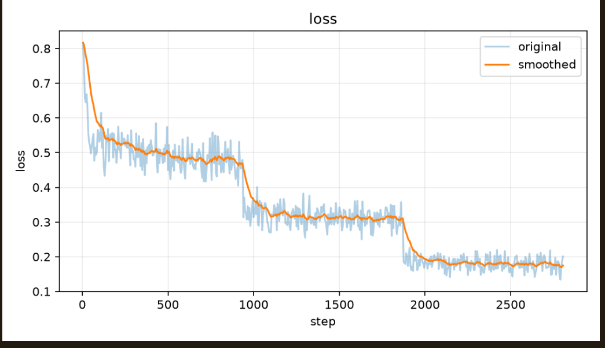
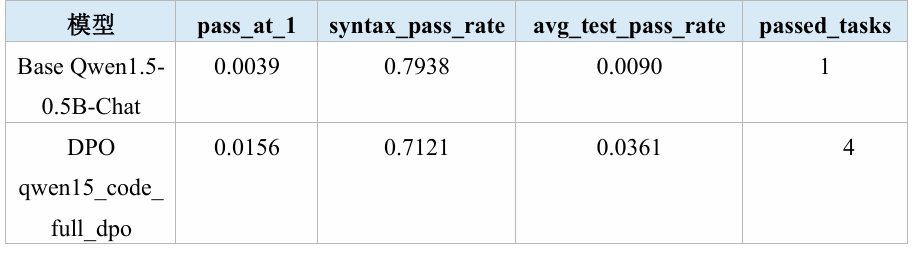
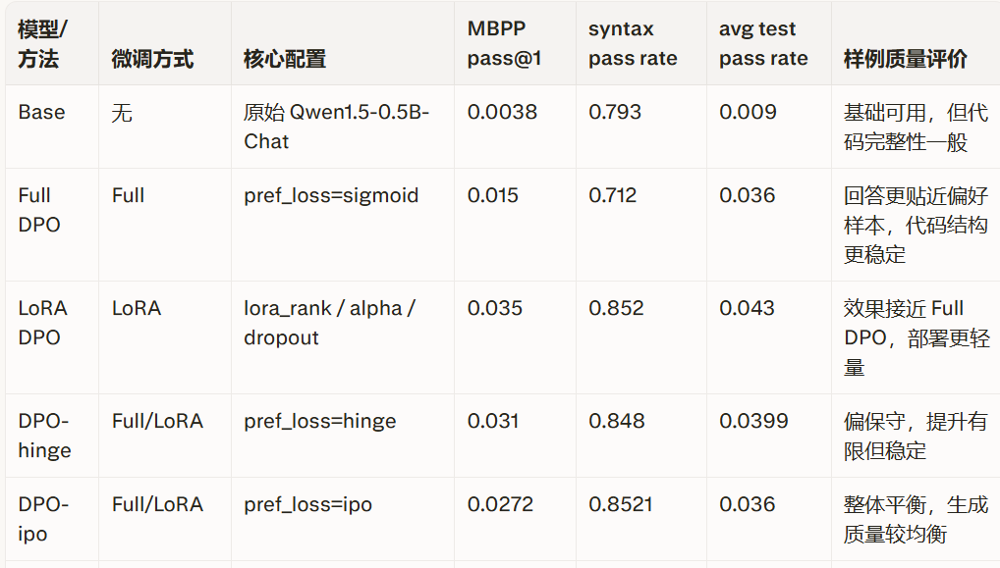
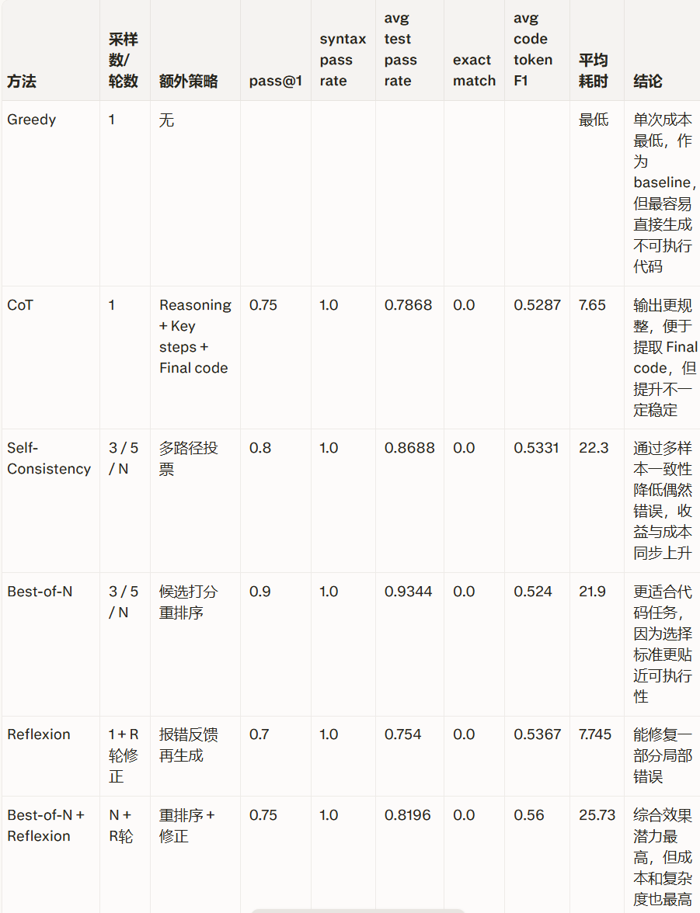

# 个人模块 README

> 本模块负责「DPO 对齐训练（A4）→ 推理增强（A5）」两个核心环节，是团队完整系统中"训练增强 + 推理增强"的关键组成部分。可脱离 SFT 模块独立运行（以已有 SFT checkpoint 和已构造的偏好数据为起点），输入已对齐数据和测试任务，输出对齐后的模型及多维评测结果。

---

## 1. 模块概述

### 1.1 模块名称

`DPO 偏好对齐训练与 Test-Time Scaling 推理增强`

### 1.2 模块说明

本模块在团队完整流水线中处于 SFT 之后、最终评测之前的位置。核心目标是：在 SFT 模型已具备基础代码指令跟随能力的基础上，通过偏好对齐训练让模型倾向于生成更高质量的代码，并在推理阶段通过 prompt 工程和采样策略进一步提升输出质量。

模块包含两个子阶段：

1. **DPO 对齐训练（A4）**：使用 LLaMA-Factory 完成 DPO（及其他偏好优化算法：KTO / PPO / RM）的对齐训练，支持 full 和 LoRA 两种微调方式，支持 sigmoid / hinge / IPO 多种损失函数。训练所需的偏好数据（code_dpo_train.json）由团队 A3 模块（偏好数据构造）提供。
2. **推理增强（A5）**：在不更新模型参数的前提下，通过 Chain-of-Thought（CoT）prompt 设计、Self-Consistency 多路径采样、Best-of-N 代码选择和 Reflexion 反思修正等 Test-Time Scaling 策略，在推理阶段提升代码生成质量。

本模块是完整系统中的必要组成部分：SFT 提供基础能力，A3 构造偏好数据，A4 进行偏好对齐训练，A5 在推理阶段进一步优化，各模块分工明确、接口清晰。

### 1.3 完成情况概览

| 类型 | 完成情况 |
|---|---|
| 基础要求 | ✅ DPO 对齐训练（full DPO, sigmoid loss, Qwen1.5-0.5B-Chat）、✅ DPO 前后对比评测（静态指标 + MBPP 执行评测）、✅ CoT prompt 设计（Reasoning/Key steps/Final code 三段式）与推理增强评测 |
| 进阶要求 | ✅ 多种 DPO 损失函数对比（sigmoid / hinge / IPO）、✅ LoRA DPO 训练（Qwen3-1.7B）、✅ KTO 偏好优化（debug）、✅ Reward Model 训练（debug）、✅ PPO 强化学习对齐（debug）、✅ Self-Consistency 多路径采样、✅ Best-of-N 代码选择与重排序、✅ Reflexion 反思修正机制、✅ 前后对比报告自动生成（metrics + cases + Markdown 报告） |
| 可独立运行的演示 | `bash dpo/scripts/train.sh`（DPO 训练）、`bash tts/run_cot_code_eval.sh`（CoT 推理增强评测）、`python3 tts/batch_compare_infer.py`（base vs DPO 对比推理） |
| 与团队系统集成情况 | 以 SFT 模块输出的 checkpoint 和 A3 模块构造的偏好数据（code_dpo_train.json）为起点；输出的 DPO 模型和评测结果供下游错误分析和代码修复模块使用；通过 `MODEL_PATH` 环境变量指定模型路径，松耦合集成 |

---

## 2. 环境、模型与数据依赖

### 2.1 运行环境

| 项目 | 要求 |
|---|---|
| Python 版本 | Python 3.10 |
| 必要依赖 | torch>=2.0, transformers>=4.38, LLaMA-Factory（项目内 `LlamaFactory/` 目录）, peft, pandas, pyarrow, datasets, accelerate |
| 是否需要模型 | 需要（Qwen1.5-0.5B-Chat 或 Qwen3-1.7B 作为基座，以及 SFT checkpoint 作为 DPO 训练起点） |
| 是否需要 GPU | 需要（full DPO ~24GB 显存，LoRA DPO ~12GB 显存；CPU 模式可调试但极慢） |
| 是否需要外部数据集 | 需要（py-dpo-v0.1 偏好数据、MBPP sanitized 评测数据；本模块不依赖 SFT 训练所使用的 python_code_instructions_18k_alpaca） |

### 2.2 模型依赖

| 模型 | 来源 | 项目内相对路径 | 用途 |
|---|---|---|---|
| `Qwen1.5-0.5B-Chat` | HuggingFace: `Qwen/Qwen1.5-0.5B-Chat` | `./Qwen1.5-0.5B-Chat` | DPO 训练基座 |
| `Qwen3-1.7B` | HuggingFace: `Qwen/Qwen3-1.7B` | `./Qwen3-1.7B` | LoRA DPO 进阶实验基座 |
| SFT checkpoint | 团队 SFT 模块输出 | `./sft/outputs/qwen15_code_full_sft` 或类似路径 | DPO 训练的 policy 和 reference 模型起点 |

```bash
# 模型下载命令（在项目根目录执行）
huggingface-cli download Qwen/Qwen1.5-0.5B-Chat --local-dir ./Qwen1.5-0.5B-Chat
huggingface-cli download Qwen/Qwen3-1.7B --local-dir ./Qwen3-1.7B
```

### 2.3 数据集或样例数据依赖

| 数据或文件 | 来源 | 项目内相对路径 | 用途 |
|---|---|---|---|
| `code_dpo_train.json` | 团队 A3 模块（偏好数据构造）输出 | `./dpo/data/code_dpo_train.json` | DPO 训练集（ranking 格式，~8.9k 条） |
| `code_dpo_test.json` | 团队 A3 模块（偏好数据构造）输出 | `./dpo/data/code_dpo_test.json` | DPO 生成测试集（~485 条） |
| `mbpp/sanitized/test-00000-of-00001.parquet` | Google Research MBPP | `./mbpp/sanitized/test-00000-of-00001.parquet` | MBPP 执行评测测试集（257 题，含 assert 测试） |

```bash
# 偏好数据由团队 A3 模块通过以下命令生成（本模块不负责此步骤）：
# bash dpo/scripts/prepare_data.sh

# 需确保 A3 已运行完毕，dpo/data/ 目录下存在 code_dpo_train.json 和 code_dpo_test.json
```

### 2.4 安装步骤

```bash
# 1. 确保在项目根目录，已激活 Conda 环境
conda activate assignment_A
cd /path/to/assignment_A

# 2. 核心依赖（如尚未安装）
pip install torch==2.5.1 transformers>=4.38 pandas pyarrow datasets peft accelerate
pip install -e LlamaFactory/

# 3. 验证环境
python -c "import torch; print(torch.cuda.is_available())"

# 4. 验证模型和数据存在
ls Qwen1.5-0.5B-Chat/
ls dpo/data/code_dpo_train.json     # 由团队 A3 模块生成
ls sft/outputs/qwen15_code_full_sft/    # SFT checkpoint，由团队 SFT 模块提供
```

本模块最小依赖：仅需 `dpo/` 和 `tts/` 目录下的脚本和配置，加上 `LlamaFactory/` 框架。不依赖 `sft/scripts/` 下的脚本（但需要 SFT 训练输出的模型 checkpoint 和 A3 输出的偏好数据）。

---

## 3. 文件结构与接口边界

### 3.1 文件结构

```text
项目根目录/
├── dpo/                                  # DPO 偏好对齐训练模块（A4）
│   ├── configs/                          # 训练和预测 YAML 配置
│   │   ├── qwen15_code_full_dpo.yaml            # Qwen1.5 全量 DPO（sigmoid loss）
│   │   ├── qwen3_code_lora_dpo.yaml              # Qwen3 LoRA DPO（sigmoid loss）
│   │   ├── qwen3_code_lora_dpo_hinge_debug.yaml  # Qwen3 LoRA DPO（hinge loss, debug）
│   │   ├── qwen3_code_lora_dpo_ipo.yaml.yaml     # Qwen3 LoRA DPO（IPO loss）
│   │   ├── qwen3_code_lora_kto_debug.yaml        # Qwen3 LoRA KTO（debug）
│   │   ├── qwen3_code_lora_rm_debug.yaml         # Qwen3 LoRA Reward Model（debug）
│   │   ├── qwen3_code_lora_ppo_debug.yaml        # Qwen3 LoRA PPO（debug）
│   │   ├── qwen15_code_predict_base.yaml         # Base 模型预测配置
│   │   └── qwen15_code_predict_dpo.yaml          # DPO 模型预测配置
│   ├── data/                              # DPO 训练/测试数据（由团队 A3 模块生成）
│   │   ├── code_dpo_train.json                   # DPO 训练集
│   │   ├── code_dpo_test.json                    # 生成测试集
│   │   ├── code_kto_train.json                   # KTO 训练集
│   │   └── code_ppo_prompt_train.json            # PPO prompt 训练集
│   ├── scripts/                           # 训练、评测脚本（本模块负责）
│   │   ├── train.sh                               # DPO 训练入口（核心）
│   │   ├── run_all.sh                             # 一键全流程（需先运行 A3 数据准备）
│   │   ├── test_code_dpo.py                       # 静态评测（base vs DPO 对比）
│   │   ├── mbpp_eval_dpo.py                       # MBPP 执行评测
│   │   ├── compare_mbpp_metrics.py                # 指标对比工具
│   │   ├── run_mbpp_base_eval.sh                  # Base 模型 MBPP 评测
│   │   ├── run_mbpp_dpo_final_eval.sh             # DPO 模型 MBPP 评测
│   │   └── run_mbpp_base_dpo_eval.sh              # Base+DPO 并行评测
│   ├── outputs/                           # 训练和评测输出（被 .gitignore 排除）
│   │   ├── qwen15_code_full_dpo/                 # DPO 对齐后模型
│   │   ├── code_test/                             # 静态评测结果
│   │   ├── mbpp_eval_base/                        # Base MBPP 执行评测
│   │   └── mbpp_eval_dpo_final/                   # DPO MBPP 执行评测
│   └── README.md                          # DPO 模块说明
│
├── tts/                                  # 推理增强模块（Test-Time Scaling, A5）
│   ├── cot_code_example.py               # CoT prompt 模板和工具函数
│   ├── evaluate_cot_code.py              # CoT + SC + Best-of-N + Reflexion 评测主脚本
│   ├── batch_compare_infer.py            # Base vs DPO 并排对比推理
│   ├── run_cot_code_eval.sh              # CoT 评测运行入口
│   └── outputs/                          # 评测输出（被 .gitignore 排除）
│       ├── cot_code_eval/                       # CoT 评测结果
│       ├── batch_compare/                       # 对比推理结果
│       └── ...
│
└── LlamaFactory/                         # 训练框架（团队共用）
```

> 注：`dpo/scripts/prepare_dpo_data.py`、`prepare_kto_data.py`、`prepare_ppo_prompt_data.py`、`prepare_data.sh` 属于团队 A3 模块（偏好数据构造），不在本模块负责范围内。

### 3.2 接口边界

| 类型 | 来源 / 去向 | 数据格式 | 说明 |
|---|---|---|---|
| 输入 | 团队 SFT 模块输出的 checkpoint | 文件路径（HuggingFace 模型目录） | DPO 训练的 policy 和 reference 模型起点，通过 YAML 配置中的 `model_name_or_path` 和 `ref_model` 指定 |
| 输入 | 外部偏好数据集 | Apache Parquet 文件 | 原始 py-dpo-v0.1 数据，通过 `--source_dir` 参数指定 |
| 输入 | MBPP 评测数据集 | Parquet 文件（含 task_id, prompt, code, test_list 等字段） | 用于执行评测，通过 `--input_file` 或 `--mbpp_dir` 指定 |
| 输出 | 下游代码修复模块 | JSONL（mbpp_cases.jsonl，含错误案例和执行反馈） | 错误分析和代码修复模块从此文件提取失败案例构建修复训练数据 |
| 输出 | 最终评测报告 | JSON（metrics.json）/ JSONL（cases.jsonl, comparison.jsonl）/ Markdown（comparison.md, report.txt） | 供团队汇报和验收使用 |

---

## 4. 基础要求实现与演示

### 4.1 基础功能说明

本模块的基础功能对应课程 A4（DPO 对齐训练）、A5（推理增强）两项基础要求：

- **A4 DPO 对齐训练**：基于 SFT checkpoint，使用 LLaMA-Factory 启动全量 DPO 训练（sigmoid loss, pref_beta=0.1），同时加载 policy 和 reference 模型进行偏好对齐。
- **A5 推理增强**：设计 CoT prompt（Reasoning → Key steps → Final code 三段式），在推理阶段引导模型输出结构化思考和可执行代码。

### 4.2 基础功能实现路径

| 文件 / 函数 / 脚本 | 作用 |
|---|---|
| `dpo/configs/qwen15_code_full_dpo.yaml` | A4 全量 DPO 训练配置（模型、数据、训练参数） |
| `dpo/scripts/train.sh` | A4 运行入口，调用 LLaMA-Factory `llamafactory.cli train` |
| `dpo/scripts/test_code_dpo.py` / `score_predictions()` | A4 静态评测：计算 syntax_pass_rate、exact_match、token_f1 |
| `dpo/scripts/mbpp_eval_dpo.py` / `evaluate_generation()` | A4 执行评测：运行 MBPP assert 测试，计算 pass@1 |
| `tts/cot_code_example.py` / `build_chat_messages()` | A5 CoT prompt 构造：生成 Qwen 格式的 Chat messages |
| `tts/cot_code_example.py` / `extract_final_code()` | A5 从 CoT 回答中提取 Final code 代码块 |
| `tts/evaluate_cot_code.py` / `score_case_once()` | A5 单题评测：语法检查 + MBPP assert 执行 |
| `tts/evaluate_cot_code.py` / `generate_outputs()` | A5 批量生成：加载模型、构造 prompt、batch 推理 |
| `tts/run_cot_code_eval.sh` | A5 运行入口，支持 `MODEL_PATH`、`BATCH_SIZE`、`--limit` 等参数 |

基础流程：

```text
[py-dpo.parquet] → prepare_dpo_data.py → [code_dpo_train.json + code_dpo_test.json]
                                                      ↓
[SFT checkpoint] → LLaMA-Factory DPO train → [DPO 对齐模型]
                                                      ↓
[DPO 模型 + MBPP tasks] → CoT prompt → 模型推理 → [CoT 回答] → extract_final_code → MBPP assert 执行 → [metrics.json]
```

### 4.3 基础功能输入格式与样例

| 字段 / 输入文件 | 类型 / 格式 | 是否必需 | 说明 |
|---|---|---|---|
| `py-dpo-v0.1/py-dpo.parquet` | Apache Parquet | 是 | 包含 prompt / chosen / rejected / id 字段 |
| `--source_dir` | 路径参数 | 否（默认 `./py-dpo-v0.1`） | 原始偏好数据目录 |
| `--output_dir` | 路径参数 | 否（默认 `./dpo/data`） | 处理后数据输出目录 |
| `--test_ratio` | 浮点数 | 否（默认 0.05） | 测试集占比 |
| `--seed` | 整数 | 否（默认 42） | 随机种子 |
| `--max_train_samples` | 整数 | 否（默认 0 = 全量） | 训练集最多样本数 |
| `--prompt_template` | 字符串 | 否（有默认模板） | 用于包装 prompt 的模板 |
| `MODEL_PATH` 环境变量 | 路径字符串 | 是（推理时） | 指定推理使用的模型路径 |

样例输入（偏好数据原始格式）：

```json
{
  "id": "sample_001",
  "prompt": "Write a Python function to reverse a linked list.",
  "chosen": "def reverse_list(head):\n    prev = None\n    curr = head\n    while curr:\n        next_node = curr.next\n        curr.next = prev\n        prev = curr\n        curr = next_node\n    return prev",
  "rejected": "def reverse_list(head):\n    return head[::-1]"
}
```

| 样例文件 | 用途 |
|---|---|
| `dpo/data/sample_preview.json` | 查看前 10 条转换后的 DPO 训练样本格式 |
| `dpo/data/code_dpo_test.json` | 查看生成测试集样例（instruction / input / output 格式） |

### 4.4 基础功能演示命令

```bash
# ===== A4: DPO 对齐训练 =====
# 单卡训练
GPU_ID=0 bash dpo/scripts/train.sh

# 指定自定义配置
CONFIG=dpo/configs/qwen15_code_full_dpo.yaml GPU_ID=0 bash dpo/scripts/train.sh

# 静态评测（base vs DPO）
python3 dpo/scripts/test_code_dpo.py --gpu_id 0

# MBPP 执行评测
BATCH_SIZE=32 bash dpo/scripts/run_mbpp_dpo_final_eval.sh

# 一键完整 DPO 流程（数据准备 + 训练 + 评测）
bash dpo/scripts/run_all.sh


# ===== A5: 推理增强 =====
# 查看 CoT prompt 模板
python3 tts/cot_code_example.py

# CoT 推理增强评测
MODEL_PATH=./dpo/outputs/qwen15_code_full_dpo \
  BATCH_SIZE=32 \
  bash tts/run_cot_code_eval.sh

# Base vs DPO 对比推理（同批任务，两个模型）
python3 tts/batch_compare_infer.py \
  --before_model ./Qwen1.5-0.5B-Chat \
  --after_model ./dpo/outputs/qwen15_code_full_dpo \
  --limit 20

# 1）单样本基线
MODEL_PATH=/root/siton-tmp/assignment_A/Qwen3-1.7B \
BATCH_SIZE=4 \
OUTPUT_DIR=tts/outputs/cot_code_eval_v2_single \
bash tts/run_cot_code_eval.sh --limit 20

# 2）Best-of-N
MODEL_PATH=/root/siton-tmp/assignment_A/Qwen3-1.7B \
BATCH_SIZE=1 \
OUTPUT_DIR=tts/outputs/cot_code_eval_v2_best3 \
bash tts/run_cot_code_eval.sh --limit 20 --selection_mode best_of_n --num_samples 3 --temperature 0.6 --top_p 0.9

# 3）Self-Consistency
MODEL_PATH=/root/siton-tmp/assignment_A/Qwen3-1.7B \
BATCH_SIZE=1 \
OUTPUT_DIR=tts/outputs/cot_code_eval_v2_sc3 \
bash tts/run_cot_code_eval.sh --limit 20 --selection_mode self_consistency --num_samples 3 --temperature 0.6 --top_p 0.9

# 4）Best-of-N + 多轮 Reflexion
MODEL_PATH=/root/siton-tmp/assignment_A/Qwen3-1.7B \
BATCH_SIZE=1 \
OUTPUT_DIR=tts/outputs/cot_code_eval_v2_best3_reflect \
bash tts/run_cot_code_eval.sh --limit 20 --selection_mode best_of_n --num_samples 3 --temperature 0.6 --top_p 0.9 --enable_reflection --reflection_rounds 2
```

运行后应观察到的现象：

- **数据准备**：终端打印 `Read N raw rows from 1 parquet file(s).`、`Kept M valid rows after cleaning/filtering.`、`Wrote train: N_t → code_dpo_train.json` 等日志；输出目录生成 `code_dpo_train.json`、`code_dpo_test.json`、`dataset_info.json`、`sample_preview.json`。
- **训练**：LLaMA-Factory 打印逐步下降的 `loss` 值；训练完成后 `dpo/outputs/qwen15_code_full_dpo/` 目录存在 `model.safetensors` 和 `training_loss.png`。
- **静态评测**：终端打印 base 和 DPO 的 syntax_pass_rate、exact_match、avg_code_token_f1 及 delta 差异。
- **MBPP 执行评测**：终端打印 pass@1、passed_tasks、passed_tests 等指标；`mbpp_cases.jsonl` 中逐条包含 passed 字段和 test_results。
- **CoT 评测**：终端打印 `finished 1/257` 到 `finished 257/257` 进度；输出 `cot_code_metrics.json` 包含 `pass_at_1`、`selection_mode` 等字段。

### 4.5 基础功能输出格式

| 输出文件 / 返回字段 | 格式 | 说明 |
|---|---|---|
| `dpo/data/code_dpo_train.json` | JSON 数组 | 每条含 instruction / input / chosen / rejected |
| `dpo/data/code_dpo_test.json` | JSON 数组 | 每条含 instruction / input / output（output = chosen） |
| `dpo/data/dataset_info.json` | JSON | LLaMA-Factory 数据集注册表，含 ranking: true 和列映射 |
| `dpo/outputs/code_test/code_dpo_test_metrics.json` | JSON | base / dpo 对比指标 + delta |
| `dpo/outputs/code_test/code_dpo_compare_cases.jsonl` | JSONL | 逐条 base vs dpo 对比 |
| `dpo/outputs/mbpp_eval_dpo_final/mbpp_metrics.json` | JSON | pass_at_1 / syntax_pass_rate / avg_test_pass_rate / passed_tasks |
| `tts/outputs/cot_code_eval/cot_code_metrics.json` | JSON | CoT 评测指标（含 syntax_pass_rate、pass_at_1、token_f1、selection_mode 等） |
| `tts/outputs/cot_code_eval/cot_code_cases.jsonl` | JSONL | 逐题 CoT 详情（含 reasoning 文本、final_code、passed、test_results 等） |

### 4.6 基础功能结果截图


*图1：DPO训练Loss 曲线*

*图2：MBPP评测指标*
---

## 5. 进阶要求实现与演示

### 5.1 选择的进阶要求

| 进阶要求 | 是否完成 | 对应文件 / 函数 | 简要说明 |
|---|---|---|---|
| 多种 DPO 损失函数对比（sigmoid / hinge / IPO） | ✅ 是 | `dpo/configs/qwen3_code_lora_dpo.yaml` / `*_hinge_debug.yaml` / `*_ipo.yaml.yaml` | 通过 `pref_loss` 参数切换损失函数，对比训练稳定性 |
| LoRA DPO 训练 | ✅ 是 | `dpo/configs/qwen3_code_lora_dpo.yaml` | 将 `finetuning_type: lora`，降低显存占用 |
| KTO 偏好优化 | ✅ 是（debug 规模） | `dpo/configs/qwen3_code_lora_kto_debug.yaml` + `prepare_kto_data.py` | `stage: kto`，无 reference model，降低显存 |
| Reward Model 训练 | ✅ 是（debug 规模） | `dpo/configs/qwen3_code_lora_rm_debug.yaml` | `stage: rm`，为 PPO 提供 reward 信号 |
| PPO 强化学习对齐 | ✅ 是（debug 规模） | `dpo/configs/qwen3_code_lora_ppo_debug.yaml` + `prepare_ppo_prompt_data.py` | `stage: ppo`，使用 RM 进行策略优化 |
| Self-Consistency 多路径采样 | ✅ 是 | `tts/evaluate_cot_code.py` / `choose_self_consistent()` + `--num_samples N --selection_mode self_consistency` | 同一题采样 N 条推理路径，按代码规范形式投票选多数一致的答案 |
| Best-of-N 代码选择 | ✅ 是 | `tts/evaluate_cot_code.py` / `choose_best_of_n()` + `--num_samples N --selection_mode best_of_n` | 生成 N 个候选，按语法正确性 > 函数签名匹配 > 测试通过数综合排序选最优 |
| Reflexion 反思修正 | ✅ 是 | `tts/evaluate_cot_code.py` / `run_reflection_rounds()` + `build_reflection_task()` | 失败后将错误信息反馈给模型，要求修正后重新生成，最多 N 轮 |

### 5.2 进阶功能 1：多种 DPO 损失函数对比

#### 功能说明

标准 DPO 使用 sigmoid loss。本进阶功能在 LoRA DPO 训练框架下，对比 sigmoid、hinge、IPO 三种损失函数在代码生成任务上的训练稳定性、收敛速度和最终评测指标差异。sigmoid 是标准选择；hinge 通过 margin 约束可能提高鲁棒性；IPO（Identity Preference Optimization）简化了偏好建模方式，理论上更稳定。

#### 实现路径

| 文件 / 函数 / 脚本 | 作用 |
|---|---|
| `dpo/configs/qwen3_code_lora_dpo.yaml` | sigmoid loss 配置（`pref_loss: sigmoid`） |
| `dpo/configs/qwen3_code_lora_dpo_hinge_debug.yaml` | hinge loss 配置（`pref_loss: hinge`，debug 规模，100 条数据 1 epoch） |
| `dpo/configs/qwen3_code_lora_dpo_ipo.yaml.yaml` | IPO loss 配置（`pref_loss: ipo`） |
| `dpo/scripts/train.sh` | 训练入口（通过 `CONFIG` 环境变量切换配置） |

流程：

```text
[SFT checkpoint] → LoRA DPO 训练 (sigmoid) → [LoRA DPO (sigmoid) 模型] → MBPP 评测
[SFT checkpoint] → LoRA DPO 训练 (hinge)   → [LoRA DPO (hinge) 模型]   → MBPP 评测
[SFT checkpoint] → LoRA DPO 训练 (IPO)     → [LoRA DPO (IPO) 模型]     → MBPP 评测
                                                         ↓
                                            对比三种 loss 的 pass@1、loss 曲线、训练时长
```

#### 输入格式与样例

| 字段 / 输入文件 / 配置项 | 类型 / 格式 | 是否必需 | 说明 |
|---|---|---|---|
| `pref_loss` | YAML 字符串字段 | 是 | 可选值：`sigmoid`、`hinge`、`ipo` |
| `pref_beta` | YAML 浮点数字段 | 是 | 偏好约束强度，默认 0.1 |

#### 演示命令

```bash
# sigmoid loss（标准 DPO）
CONFIG=dpo/configs/qwen3_code_lora_dpo.yaml GPU_ID=0 bash dpo/scripts/train.sh

# hinge loss（debug 规模，快速验证）
CONFIG=dpo/configs/qwen3_code_lora_dpo_hinge_debug.yaml GPU_ID=0 bash dpo/scripts/train.sh

# IPO loss
CONFIG=dpo/configs/qwen3_code_lora_dpo_ipo.yaml.yaml GPU_ID=0 bash dpo/scripts/train.sh

# 分别评测三种模型
MODEL_PATH=./dpo/outputs/qwen3_code_lora_dpo BATCH_SIZE=32 bash dpo/scripts/run_mbpp_dpo_final_eval.sh
```

#### 输出格式

| 输出文件 / 返回字段 | 格式 | 说明 |
|---|---|---|
| `dpo/outputs/qwen3_code_lora_dpo/` | 模型目录 | sigmoid DPO 模型 + loss 曲线 |
| `dpo/outputs/qwen3_code_lora_dpo_hinge_debug/` | 模型目录 | hinge DPO 模型 + loss 曲线 |
| 各模型 MBPP 评测的 `mbpp_metrics.json` | JSON | pass@1 / syntax_pass_rate / avg_test_pass_rate |

#### 示例图片


*图3：三种 DPO Loss 的 MBPP 指标对比*

### 5.3 进阶功能 2：Self-Consistency 与 Best-of-N 推理增强

#### 功能说明

在 CoT prompt 基础上，引入两种 Test-Time Scaling 策略：

- **Self-Consistency**：对同一道题采样 `N` 条不同的推理路径（temperature > 0），提取每条路径的 Final code，按规范化后的代码文本投票，选择出现次数最多的代码作为最终答案。
- **Best-of-N**：对同一道题生成 `N` 个候选代码，按评分函数（语法正确 > 函数签名匹配 > 测试通过数 > 非空代码）排序，选择得分最高的候选作为最终答案。

这两种策略不修改模型参数，仅在推理阶段投入更多计算，适合在部署时根据延迟/质量需求灵活选择。

#### 实现路径

| 文件 / 函数 / 脚本 | 作用 |
|---|---|
| `tts/evaluate_cot_code.py` / `evaluate_one_row_with_strategy()` | 策略分发：根据 `selection_mode` 调用不同选择逻辑 |
| `tts/evaluate_cot_code.py` / `generate_n_outputs_for_task()` | 将同一 task 复制 N 份，使用 temperature > 0 生成 N 条路径 |
| `tts/evaluate_cot_code.py` / `choose_self_consistent()` / `canonicalize_code_for_vote()` | Self-Consistency：规范化代码文本后按频率投票 |
| `tts/evaluate_cot_code.py` / `choose_best_of_n()` / `candidate_score()` | Best-of-N：按多维评分排序选最优 |

流程：

```text
[同一 task] → 复制 N 份 → 使用 temperature=0.6 独立生成 N 条 CoT 回答
                                    ↓
                    每条回答 → extract_final_code → score_case_once
                                    ↓
              ┌─────────────────────┴─────────────────────┐
              ↓                                           ↓
    Self-Consistency:                            Best-of-N:
    规范化代码文本 → 投票 → 选多数      评分(语法,签名,测试) → 排序 → 选最优
              ↓                                           ↓
              └─────────────────────┬─────────────────────┘
                                    ↓
                            [最终 case + 指标]
```

#### 输入格式与样例

| 字段 / 输入文件 / 配置项 | 类型 / 格式 | 是否必需 | 说明 |
|---|---|---|---|
| `--num_samples` | 整数 | 是（>1） | 采样路径数 N |
| `--selection_mode` | 字符串 | 是 | `self_consistency` 或 `best_of_n` |
| `--temperature` | 浮点数 | 是（>0） | 采样温度，确保各路径有差异 |

#### 演示命令

```bash
# Self-Consistency：5 条路径，按多数投票选答案
MODEL_PATH=./dpo/outputs/qwen15_code_full_dpo \
  bash tts/run_cot_code_eval.sh \
  --num_samples 5 --selection_mode self_consistency --temperature 0.6

# Best-of-N：5 条路径，按综合评分选最优
MODEL_PATH=./dpo/outputs/qwen15_code_full_dpo \
  bash tts/run_cot_code_eval.sh \
  --num_samples 5 --selection_mode best_of_n --temperature 0.6

# 快速调试（20 题）
MODEL_PATH=./dpo/outputs/qwen15_code_full_dpo \
  bash tts/run_cot_code_eval.sh \
  --num_samples 3 --selection_mode self_consistency --temperature 0.6 --limit 20
```

#### 输出格式

| 输出文件 / 返回字段 | 格式 | 说明 |
|---|---|---|
| `cot_code_metrics.json` 中的 `selection_mode` | 字符串 | 标识使用策略（"self_consistency" / "best_of_n"） |
| `cot_code_metrics.json` 中的 `avg_self_consistency_rate` | 浮点数 | Self-Consistency 模式下多路径平均一致率 |
| `cot_code_cases.jsonl` 中的 `candidate_summaries` | 数组 | 各候选的评分摘要（syntax_ok / passed_tests / total_tests） |
| `cot_code_cases.jsonl` 中的 `num_candidates` | 整数 | 实际生成的候选数 |

#### 示例图片


*图4：不同推理增强策略评测指标对比图*

### 5.4 进阶功能 3：Reflexion 反思修正

#### 功能说明

当模型生成的代码在 MBPP assert 测试中失败时，Reflexion 机制将错误信息（stderr）作为反馈，构造反思 prompt 重新输入模型，要求模型根据执行反馈修正代码。最多进行 `--reflection_rounds` 轮修正，每轮比较修正前后的评分，保留最优结果。

#### 实现路径

| 文件 / 函数 / 脚本 | 作用 |
|---|---|
| `tts/evaluate_cot_code.py` / `run_reflection_rounds()` | 反思修正主循环：失败 → 构造反思 prompt → 重新生成 → 评分 → 保留最优 |
| `tts/evaluate_cot_code.py` / `build_reflection_task()` | 构造反思 prompt（原始任务 + 失败代码 + 执行错误信息） |
| `tts/evaluate_cot_code.py` / `pick_primary_error()` | 从测试结果中提取第一个非空 stderr 作为反馈 |

流程：

```text
[初始生成失败] → 提取 stderr 错误信息 → build_reflection_task()
                                                    ↓
                        [reflection prompt] → 模型重新生成 → score_case_once
                                                    ↓
                              比较 candidate_score(修正) vs candidate_score(最优)
                                                    ↓
                              保留更优 → 若仍失败且轮数未满 → 继续反思
```

#### 演示命令

```bash
# 启用 Reflexion，最多 2 轮修正
MODEL_PATH=./dpo/outputs/qwen15_code_full_dpo \
  bash tts/run_cot_code_eval.sh \
  --enable_reflection --reflection_rounds 2

# 结合 Best-of-N + Reflexion（先选最优候选，失败后再反思修正）
MODEL_PATH=./dpo/outputs/qwen15_code_full_dpo \
  bash tts/run_cot_code_eval.sh \
  --num_samples 5 --selection_mode best_of_n --temperature 0.6 \
  --enable_reflection --reflection_rounds 2

# 快速调试
MODEL_PATH=./dpo/outputs/qwen15_code_full_dpo \
  bash tts/run_cot_code_eval.sh \
  --enable_reflection --reflection_rounds 2 --limit 20
```

#### 输出格式

| 输出文件 / 返回字段 | 格式 | 说明 |
|---|---|---|
| `cot_code_metrics.json` 中的 `reflection_used_count` | 整数 | 实际触发了反思修正的题目数 |
| `cot_code_cases.jsonl` 中的 `used_reflection` | 布尔 | 该题是否使用了反思修正 |
| `cot_code_cases.jsonl` 中的 `reflection_rounds_used` | 整数 | 该题实际使用的反思轮数 |

---

## 6. 与团队系统的集成说明

### 6.1 集成方式

本模块在团队完整系统中的位置和调用关系：

- **上游依赖（SFT 模块）**：本模块以 SFT 模块输出的 **模型 checkpoint 目录** 作为输入。DPO 训练配置文件中的 `model_name_or_path` 和 `ref_model` 字段需指向 SFT checkpoint 路径（例如 `./sft/outputs/qwen15_code_full_sft`）。本模块不调用 SFT 脚本，仅通过文件路径读取模型。
- **下游输出（错误分析/代码修复模块）**：本模块的 MBPP 执行评测输出 `mbpp_cases.jsonl`（包含每题 passed 状态、代码、测试结果、stderr）是下游错误分析和代码修复模块的输入。`sft/scripts/repair/error_analysis.py` 直接读取 `mbpp_cases.jsonl` 进行分类统计；`build_code_repair_dataset.py` 从中提取失败案例构建修复数据集。
- **调用方式**：通过环境变量 `MODEL_PATH` 传递模型路径，通过配置文件 YAML 指定数据和训练参数，松耦合集成。

### 6.2 与 SFT 模块的接口约定

| 约定项 | 内容 |
|---|---|
| SFT 输出格式 | HuggingFace 标准模型目录（含 `config.json`、`model.safetensors`、`tokenizer.json` 等） |
| DPO 读取方式 | YAML 配置中 `model_name_or_path: ./sft/outputs/qwen15_code_full_sft` |
| 路径约定 | 以项目根目录为基准的相对路径 |

### 6.3 与代码修复模块的接口约定

| 约定项 | 内容 |
|---|---|
| 本模块输出格式 | `mbpp_cases.jsonl`，每行 JSON 对象含 `task_id`、`code`、`passed`、`passed_tests`、`total_tests`、`test_results`（每个测试的 passed/stderr）、`prompt`、`reference_code` |
| 修复模块读取方式 | 直接 `open(mbpp_cases.jsonl)` 逐行读取 JSON 对象 |
| 联调注意事项 | 需确保评测时使用了相同版本的 MBPP 测试集（sanitized config, test split），task_id 能对齐 |

### 6.4 联调中遇到的问题与解决

- **配置文件绝对路径不一致**：不同成员的训练环境路径不同。解决：通过环境变量 `MODEL_PATH` 传参，推理脚本中优先级为命令行参数 > 环境变量 > 默认值。
- **MBPP 测试集版本**：SFT 评测和 DPO 评测需使用同一份 MBPP 数据，否则 task_id 无法对齐。解决：统一使用 `mbpp/sanitized/test-00000-of-00001.parquet` 路径，在脚本默认值中固定。
- **DPO 训练依赖 SFT checkpoint 是否存在**：若未先运行 SFT 模块，DPO 训练会因找不到模型路径而失败。解决：在 `train.sh` 中增加前置检查，提示先完成 SFT 训练。

---

## 7. 已知问题与后续改进

| 问题 | 当前原因 | 后续改进 |
|---|---|---|
| KTO/PPO 实验仅在 debug 规模（100-200 条数据、1 epoch）验证 | 完整 KTO/PPO 训练计算量较大，debug 配置用于快速验证流程正确性 | 扩大数据到全量（8.9k 条），增加训练轮数，完成完整的 KTO/PPO 实验并与 DPO 对比 |
| PPO 缺乏基于执行反馈的 Reward | PPO 当前仅使用 Reward Model（RM）打分，未利用代码实际执行结果作为 reward 信号 | 增加基于 MBPP assert 测试通过率的执行反馈 reward，让 PPO 直接优化代码可运行性 |
| CoT 评测中 Reflexion 仅基于 stderr 文本 | 反思 prompt 仅包含错误信息原文，未结构化地指出是哪一步出错 | 增加错误分类标签（语法错误 / 类型错误 / 逻辑错误），让反思更有针对性 |
| Self-Consistency 归一化比较粗糙 | `canonicalize_code_for_vote()` 仅去除空行和尾部空格，未处理变量名重命名等语义等价 | 引入 AST 级别的代码规范化（如统一变量名、移除注释），提高语义等价的投票聚合 |
| CoT prompt 缺少思维链引导 | 当前 prompt 模板只有固定 few-shot 示例，未根据任务类型自适应调整 | 根据 classify_task_type() 分类结果动态选择相关示例，或实现基于检索的 few-shot 选择 |
| 对比报告 Markdown 生成仅有前 N 条 | `batch_compare_infer.py` 的 Markdown 报告默认仅包含前 20 条 | 增加 --markdown_cases 参数支持，当前已支持该参数，默认值可调整为更大 |
| `dpo/configs/qwen3_code_lora_dpo_ipo.yaml.yaml` 文件名含重复 `.yaml` | 文件命名疏忽 | 重命名为 `qwen3_code_lora_dpo_ipo.yaml`（注意同步更新引用该文件的脚本） |
