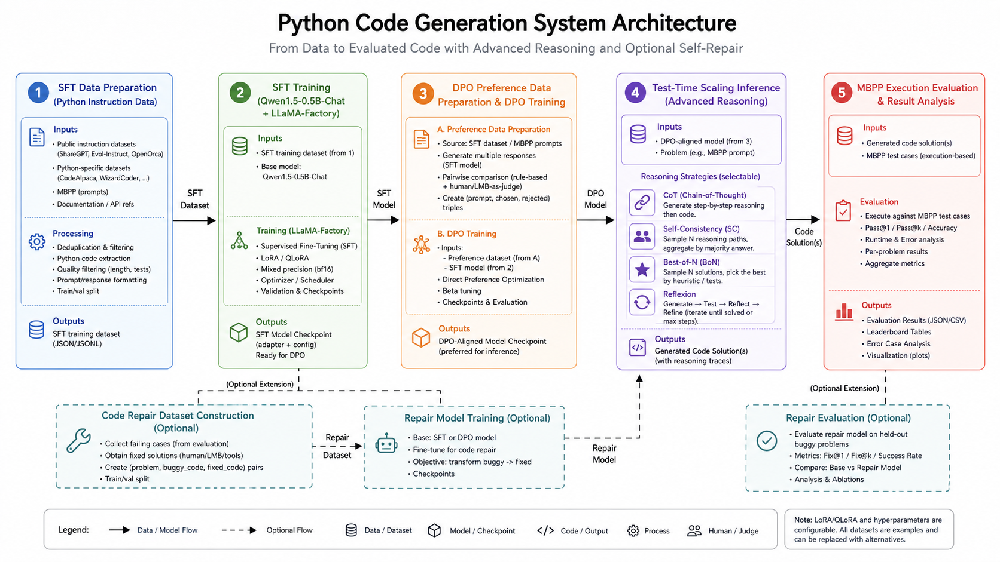
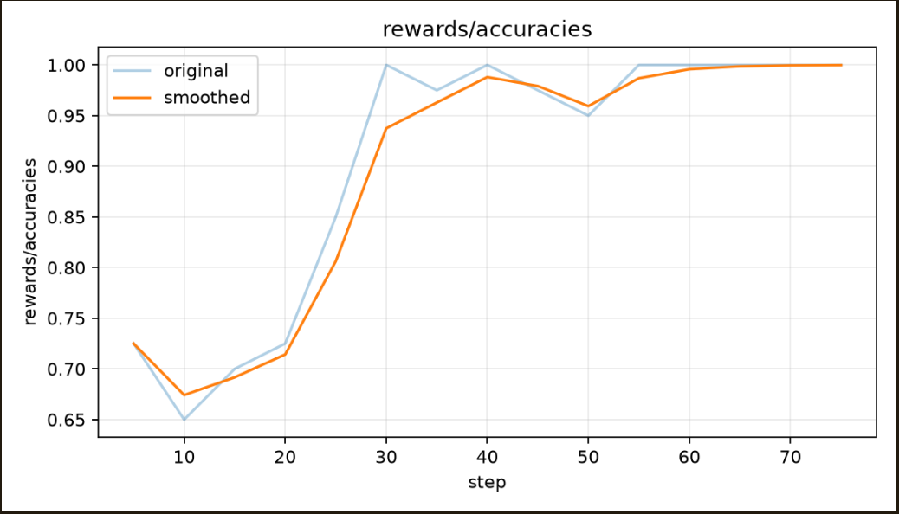
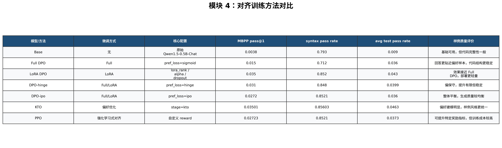
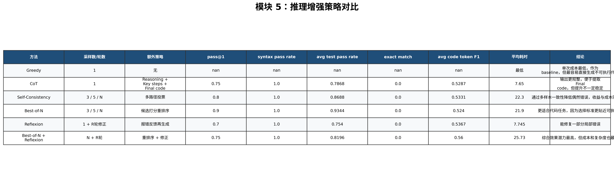

# 团队项目 README

> 本项目为「推理 / 强化学习 / 对齐」方向（A 方向）团队实训项目，围绕 Python 代码生成任务，完成从监督微调（SFT）、偏好数据构造、DPO 对齐训练到推理增强（CoT + Test-Time Scaling）的完整流水线。

---

## 1. 项目概述

### 1.1 项目名称

`CodeAlign — 代码生成任务的模型偏好对齐与推理增强`

### 1.2 项目目标

本项目面向 Python 代码生成任务，基于本地 Qwen 系列模型（Qwen1.5-0.5B-Chat / Qwen3-1.7B），使用 LLaMA-Factory 训练框架，依次完成：

1. **SFT 监督微调**：在 18k Alpaca 格式的 Python 代码指令数据上，对基座模型进行监督微调，使其具备基本的代码指令跟随能力。
2. **偏好数据构造与 DPO 对齐训练**：将 py-dpo-v0.1 偏好数据转换为 DPO ranking 格式，使用多种损失函数（sigmoid / hinge / IPO）和训练方式（full / LoRA）进行偏好对齐训练。
3. **推理增强（Test-Time Scaling）**：在不更新模型参数的前提下，通过 Chain-of-Thought（CoT）prompt 设计、Self-Consistency 多路径采样、Best-of-N 重排序和 Reflexion 反思修正等策略，提升推理阶段的代码生成质量。
4. **代码修复（Code Repair）**：基于 SFT 模型在 MBPP 上的错误案例，构建修复训练数据并微调专用修复模型。
5. **系统评测**：使用 MBPP sanitized 执行评测（子进程中运行 assert 测试），以 pass@1、syntax_pass_rate、avg_test_pass_rate 等指标量化模型性能。

### 1.3 当前完成情况

| 类型 | 完成情况 |
|---|---|
| 基础要求 | SFT 数据构造（含去重/无效限制/数量限制）、SFT 全量微调（Qwen1.5-0.5B）、偏好数据构造（py-dpo-v0.1 → DPO ranking 格式）、DPO 全量对齐训练、MBPP 执行评测、CoT prompt 推理增强 |
| 进阶要求 | SFT 数据构造（长度过滤/语法可解析性筛选/任务完整性检查/任务类型均衡采样）、LoRA/QLoRA SFT 微调（Qwen3-1.7B）及超参数对比实验、针对代码生成任务设计的错误分析模块、多种 DPO 损失函数对比（sigmoid / hinge / IPO）、KTO 偏好优化（debug）、Reward Model 训练（debug）、PPO 强化学习对齐（debug）、Self-Consistency 多路径采样、Best-of-N 代码选择、Reflexion 反思修正、代码修复（Code Repair）专项模型、错误分类分析报告 |
| 支持的主要任务类型 | Python 函数级代码生成（算法、数据结构、字符串处理、数学计算、文件 I/O、Web API、数据科学等 10 类任务）、错误代码修复 |
| 当前限制 | Qwen3 系列模型的高级对齐实验（KTO/PPO）仅在 debug 规模验证，尚未大规模训练；PPO 的 reward设计有待进一步提升；部分输出依赖本地路径，需根据实际环境调整配置文件中的绝对路径 |

---

## 2. 整体流程与模块结构

### 2.1 模块边界

| 模块 / 阶段 | 入口文件 / 入口函数 | 主要职责 | 输入 | 输出 |
|---|---|---|---|---|
| SFT 数据准备 | `sft/scripts/prepare_code_sft_data.py` | 读取原始 parquet，清洗/去重/过滤/均衡采样，生成 Alpaca 格式训练数据 | `python_code_instructions_18k_alpaca/` 中的 parquet 文件 | `sft/data/code_sft_train.json`, `code_sft_valid.json`, `code_sft_test.json`, `dataset_info.json`, `data_statistics.json`, `bad_cases.json` |
| SFT 训练 | `sft/scripts/train.sh` → LLaMA-Factory | 在代码指令数据上进行监督微调（full / LoRA / QLoRA） | SFT 训练数据 + 配置文件 | `sft/outputs/qwen15_code_full_sft/`（模型权重、checkpoint、loss 曲线） |
| SFT 评测 | `sft/scripts/evaluate_code_predictions.py` | 对 SFT 模型在 MBPP 测试集上执行评测 | `generated_predictions.jsonl` + MBPP parquet | `sft/outputs/eval_mbpp/mbpp_metrics.json`, `mbpp_cases.jsonl` |
| 偏好数据构造（DPO） | `dpo/scripts/prepare_dpo_data.py` | 将 py-dpo-v0.1 原始偏好数据转换为 LLaMA-Factory DPO ranking 格式 | `py-dpo-v0.1/py-dpo.parquet` | `dpo/data/code_dpo_train.json`, `code_dpo_test.json`, `dataset_info.json` |
| DPO 训练 | `dpo/scripts/train.sh` → LLaMA-Factory | 基于偏好数据做 DPO/KTO/PPO 对齐训练 | DPO 训练数据 + 配置文件 + SFT 模型（作为 policy 和 reference） | `dpo/outputs/qwen15_code_full_dpo/`（对齐后模型） |
| DPO 静态评测 | `dpo/scripts/test_code_dpo.py` | 对比 base 和 DPO 模型的生成结果（语法检查、exact match、token F1） | base 和 DPO 的 `generated_predictions.jsonl` | `dpo/outputs/code_test/code_dpo_test_metrics.json`, `code_dpo_compare_cases.jsonl` |
| DPO 执行评测 | `dpo/scripts/mbpp_eval_dpo.py` | 对 DPO 模型在 MBPP 上执行评测（实际运行 assert 测试） | MBPP parquet + 模型路径 | `dpo/outputs/mbpp_eval_dpo/mbpp_metrics.json`, `mbpp_cases.jsonl` |
| 推理增强（CoT） | `tts/evaluate_cot_code.py` | 使用 CoT prompt + Self-Consistency / Best-of-N / Reflexion 进行推理增强评测 | MBPP parquet + 模型路径 | `tts/outputs/cot_code_eval/cot_code_metrics.json`, `cot_code_cases.jsonl` |
| 前后对比推理 | `tts/batch_compare_infer.py` | 批量加载 base 和 after 模型，对同一批任务生成并对比 | 测试数据（JSON/JSONL）+ 两个模型路径 | `tts/outputs/batch_compare/metrics.json`, `comparison.jsonl`, `comparison.md` |
| 代码修复（Repair） | `sft/scripts/repair/build_code_repair_dataset.py` → `repair.sh` | 从 SFT 错误案例构建修复训练集，训练修复模型并评测 | MBPP cases（失败样本） | `sft/data/code_repair_train.json`, `sft/outputs/qwen3_code_repair_lora/`, `code_repair_report.txt` |
| 错误分析 | `sft/scripts/repair/error_analysis.py` | 将 MBPP 错误案例按类型分类（语法错误/函数签名/IO 格式/运行时/边界条件等） | `mbpp_cases.jsonl` | `sft/outputs/error_analysis_lora_report.txt` |

### 2.2 系统架构图或流程图


*图1：CodeAlign 系统整体架构图*

### 2.3 一次完整任务或实验的流程

以「Python 代码生成任务的偏好对齐全流程」为例：

1. **原始输入**：
   - SFT 数据：`python_code_instructions_18k_alpaca/` 中的 parquet 文件（~18k 条 Python 代码指令-答案对）
   - 偏好数据：`py-dpo-v0.1/py-dpo.parquet`（包含 prompt / chosen / rejected 三元组）
   - 评测数据：`mbpp/sanitized/test-00000-of-00001.parquet`（MBPP 测试集，含 assert 测试用例）

2. **SFT 数据预处理**（`sft/scripts/prepare_code_sft_data.py`）：
   - 读取 parquet → 提取 instruction/input/output → 去重 → 长度过滤 → 高质量筛选（ast.parse 语法检查 + 任务完整性检查）→ 任务类型均衡采样 → 90%/5%/5% 划分 train/valid/test
   - 输出 `code_sft_train.json`、`code_sft_valid.json`、`code_sft_test.json` 及统计信息 `data_statistics.json`

3. **SFT 训练**：LLaMA-Factory 加载 `Qwen1.5-0.5B-Chat`，使用 `sft/configs/qwen15_code_full_sft.yaml` 进行全量微调 3 轮

4. **DPO 数据预处理**（`dpo/scripts/prepare_dpo_data.py`）：
   - 读取 py-dpo.parquet → 清洗（过滤缺失字段样本）→ 按 95%/5% 划分训练/测试 → 训练集转为 instruction/input/chosen/rejected 格式，测试集转为 instruction/input/output 格式

5. **DPO 训练**：LLaMA-Factory 加载 SFT checkpoint 作为 policy 和 reference model，使用 `dpo/configs/qwen15_code_full_dpo.yaml` 训练，pref_loss=sigmoid, pref_beta=0.1

6. **评测**：
   - 静态评测：`dpo/scripts/test_code_dpo.py` 对比 base/DPO 模型的 syntax_pass_rate、exact_match、token F1
   - 执行评测：`dpo/scripts/mbpp_eval_dpo.py` 在 MBPP 上实际运行 assert 测试，统计 pass@1
   - CoT 评测：`tts/evaluate_cot_code.py` 使用 CoT prompt 评测，可选 Self-Consistency / Best-of-N / Reflexion

7. **最终输出**：各模块输出目录中的 `metrics.json`（评测指标）、`cases.jsonl`（逐题详情）、`comparison.jsonl`（前后对比），以及模型权重目录

8. **日志与可视化**：LLaMA-Factory 自动保存 `training_loss.png`、`trainer_state.json`；数据处理脚本输出详细统计；错误分析脚本输出分类报告

---

## 3. 模型、数据集与外部资源

### 3.1 模型说明

| 项目 | 内容 |
|---|---|
| 使用模型 | `Qwen1.5-0.5B-Chat`（基础实验）、`Qwen3-1.7B`（进阶实验，含 LoRA/QLoRA/Repair） |
| 模型来源 | HuggingFace：`Qwen/Qwen1.5-0.5B-Chat`、`Qwen/Qwen3-1.7B`（需手动下载到项目根目录） |
| 项目内相对路径 | `./Qwen1.5-0.5B-Chat`、`./Qwen3-1.7B`、`./Qwen3-1.7B-Base`（由 `.gitignore` 排除，需自行下载） |
| 是否需要 GPU | 需要（建议至少 1 张 NVIDIA GPU，full DPO 需 ~24GB 显存，LoRA 可在 ~12GB 显存运行） |
| 是否需要联网运行 | 不需要（设置 `HF_DATASETS_OFFLINE=1`、`TRANSFORMERS_OFFLINE=1` 即可离线运行） |

模型下载命令（在项目根目录执行）：

```bash
# Qwen1.5-0.5B-Chat（基础模型）
pip install huggingface_hub
huggingface-cli download Qwen/Qwen1.5-0.5B-Chat --local-dir ./Qwen1.5-0.5B-Chat

# Qwen3-1.7B（进阶模型，可选）
huggingface-cli download Qwen/Qwen3-1.7B --local-dir ./Qwen3-1.7B
```

### 3.2 数据集 / 示例数据说明

| 数据或文件 | 用途 | 来源 | 项目内相对路径 |
|---|---|---|---|
| `python_code_instructions_18k_alpaca` | SFT 训练的原始代码指令数据（~18k 条） | HuggingFace（需自行下载） | `./python_code_instructions_18k_alpaca/` |
| `py-dpo-v0.1/py-dpo.parquet` | DPO 偏好训练的原始数据（prompt/chosen/rejected） | https://huggingface.co/datasets/jondurbin/py-dpo-v0.1 | `./py-dpo-v0.1/py-dpo.parquet` |
| `mbpp/sanitized/` | MBPP 评测数据集（含 test/prompt/validation 切分） | https://huggingface.co/datasets/google-research-datasets/mbpp | `./mbpp/sanitized/` |
| `code_sft_train.json` | SFT 训练集（Alpaca 格式） | 项目脚本自动生成 | `./sft/data/code_sft_train.json` |
| `code_sft_valid.json` | SFT 验证集 | 项目脚本自动生成 | `./sft/data/code_sft_valid.json` |
| `code_sft_test.json` | SFT 测试集 | 项目脚本自动生成 | `./sft/data/code_sft_test.json` |
| `code_dpo_train.json` | DPO 训练集（ranking 格式） | 项目脚本自动生成 | `./dpo/data/code_dpo_train.json` |
| `code_dpo_test.json` | DPO 生成测试集 | 项目脚本自动生成 | `./dpo/data/code_dpo_test.json` |
| `code_repair_train.json` | 代码修复训练集 | 从 MBPP 错误案例自动构建 | `./sft/data/code_repair_train.json` |

```bash
# 数据集需手动下载到项目根目录的对应路径
# 以 py-dpo-v0.1 为例：
# huggingface-cli download jondurbin/py-dpo-v0.1 --local-dir ./py-dpo-v0.1
```

---

## 4. 环境安装

### 4.1 运行环境

| 项目 | 要求 |
|---|---|
| Python 版本 | Python 3.10 |
| 操作系统 / 服务器环境 | Linux（推荐 Ubuntu 20.04+）/ 支持 Windows（需适配路径和 shell 脚本） |
| GPU 要求 | NVIDIA GPU（建议 ≥ 12GB 显存，full DPO 建议 ≥ 24GB）；支持 CPU 调试模式但速度极慢 |
| 主要依赖 | torch>=2.0, transformers>=4.38, LLaMA-Factory（项目内 `LlamaFactory/` 目录）, peft, pandas, pyarrow, datasets, accelerate |

### 4.2 安装步骤

```bash
# 1. 克隆项目
git clone <仓库地址>
cd codealign_shixun    # 或 assignment_A

# 2. 创建并激活 Conda 环境（推荐）
conda create -n assignment_A python=3.10 -y
conda activate assignment_A

# 3. 安装 PyTorch（根据 CUDA 版本选择）
# CUDA 12.4 示例：
pip install torch==2.5.1 torchvision==0.20.1 torchaudio==2.5.1 --index-url https://download.pytorch.org/whl/cu124

# 4. 安装 LLaMA-Factory 依赖
pip install -r LlamaFactory/requirements.txt

# 5. 安装项目额外依赖
pip install pandas pyarrow datasets peft accelerate

# 6. 安装 LLaMA-Factory（开发模式）
pip install -e LlamaFactory/

# 7. 下载模型和数据集（见 3.1、3.2 节）

# 8. 验证环境
python -c "import torch; print(torch.__version__); print(torch.cuda.is_available()); print(torch.cuda.device_count())"
```

常见环境问题：

- **torchvision::nms does not exist**：torch 与 torchvision 版本不匹配。torch 2.5.1+cu124 建议 torchvision==0.20.1。
- **libcudart.so.13 not found**：torchaudio 版本过新。torch 2.5.1 建议 torchaudio==2.5.1。
- **DPO 训练 OOM**：降低 `per_device_train_batch_size` 或 `cutoff_len`，使用 LoRA 替代 full，或增加 GPU 数量。
- **模型路径不存在**：确保已下载模型到项目根目录，且配置文件中的路径正确。`.gitignore` 默认排除了模型和输出目录。

---

## 5. 输入文件与配置文件说明

### 5.1 主要配置文件

| 配置文件 | 作用 | 需要修改的字段 |
|---|---|---|
| `sft/configs/qwen15_code_full_sft.yaml` | Qwen1.5 全量 SFT 训练 | `model_name_or_path`、`output_dir`、`dataset_dir` |
| `sft/configs/qwen3_code_lora.yaml` | Qwen3 LoRA SFT 训练 | `model_name_or_path`、`output_dir`、`lora_rank`、`lora_alpha` |
| `sft/configs/qwen3_code_qlora.yaml` | Qwen3 QLoRA SFT 训练 | 同上，注意量化配置 |
| `sft/configs/qwen3_code_repair_lora.yaml` | Qwen3 代码修复 LoRA 训练 | `model_name_or_path`、`output_dir`，训练轮数默认 10 轮 |
| `dpo/configs/qwen15_code_full_dpo.yaml` | Qwen1.5 全量 DPO 训练（sigmoid loss） | `model_name_or_path`（需指向 SFT checkpoint）、`ref_model`、`output_dir` |
| `dpo/configs/qwen3_code_lora_dpo.yaml` | Qwen3 LoRA DPO 训练（sigmoid loss） | 同上，注意 `finetuning_type: lora` |
| `dpo/configs/qwen3_code_lora_dpo_hinge_debug.yaml` | Qwen3 LoRA DPO 训练（hinge loss，debug） | `pref_loss: hinge`，`max_samples: 100` |
| `dpo/configs/qwen3_code_lora_dpo_ipo.yaml.yaml` | Qwen3 LoRA DPO 训练（IPO loss） | `pref_loss: ipo` |
| `dpo/configs/qwen3_code_lora_kto_debug.yaml` | Qwen3 LoRA KTO 训练（debug） | `stage: kto`，数据需用 `code_kto_train.json` |
| `dpo/configs/qwen3_code_lora_rm_debug.yaml` | Qwen3 LoRA Reward Model 训练（debug） | `stage: rm` |
| `dpo/configs/qwen3_code_lora_ppo_debug.yaml` | Qwen3 LoRA PPO 训练（debug） | `stage: ppo`，需先训练 reward_model |
| `dpo/configs/qwen15_code_predict_base.yaml` | Base 模型预测配置 | `model_name_or_path`（指向 base 模型） |
| `dpo/configs/qwen15_code_predict_dpo.yaml` | DPO 模型预测配置 | `model_name_or_path`（指向 DPO 模型） |
| `sft/data/dataset_info.json` | SFT 数据集注册表 | 添加新数据集时需更新 |
| `dpo/data/dataset_info.json` | DPO 数据集注册表（含 ranking 列映射） | 添加新数据集时需更新 |

### 5.2 主要输入文件

| 输入文件 | 用途 | 适用场景 |
|---|---|---|
| `sft/data/code_sft_train.json` | SFT 训练集（~4.8k 条高质量样本） | SFT 训练 |
| `sft/data/code_sft_test.json` | SFT 测试集（用于推理评测） | SFT 评测 |
| `sft/data/mbpp_sanitized_train.json` | MBPP 格式训练集（供混合训练） | SFT 训练（Qwen3 系列使用） |
| `dpo/data/code_dpo_train.json` | DPO 训练集（~8.9k 条 ranking 样本） | DPO 训练 |
| `dpo/data/code_dpo_test.json` | DPO 生成测试集（~485 条） | DPO 评测 |
| `dpo/data/code_kto_train.json` | KTO 训练集 | KTO 训练 |
| `dpo/data/code_ppo_prompt_train.json` | PPO prompt 训练集 | PPO 训练 |
| `sft/data/code_repair_train_split.json` | 代码修复训练集 | Repair 训练 |
| `sft/data/code_repair_valid.json` | 代码修复验证集 | Repair 验证 |
| `sft/data/code_repair_test.json` | 代码修复测试集 | Repair 评测 |

---

## 6. 完整流程 Demo 运行

### 6.1 Demo 样例说明

| Demo | 输入文件 / 输入内容 | 演示目的 |
|---|---|---|
| Demo 1：SFT 全流程 | `python_code_instructions_18k_alpaca/` | 验证数据准备 → 训练 → 预测 → MBPP 执行评测的完整 SFT 流水线 |
| Demo 2：DPO 全流程 | `py-dpo-v0.1/py-dpo.parquet` + SFT checkpoint | 验证偏好数据构造 → DPO 训练 → 静态评测 → MBPP 执行评测 |
| Demo 3：推理增强对比 | 同一批 MBPP 任务 + base/DPO 模型 | 对比普通推理 vs CoT vs Self-Consistency vs Best-of-N vs Reflexion 的效果 |
| Demo 4：代码修复 | MBPP 失败案例 | 验证错误分析 → 修复数据构造 → 修复模型训练 → 修复效果评测 |

### 6.2 运行命令

```bash
# ===== 环境准备 =====
cd /path/to/assignment_A    # 项目根目录
conda activate assignment_A

# ===== Demo 1：SFT 全流程 =====
# 1.1 数据准备（含去重/长度过滤/语法检查/任务完整性检查/均衡采样）
bash sft/scripts/prepare_data.sh

# 1.2 SFT 训练
GPU_ID=0 bash sft/scripts/train.sh

# 1.3 测试集预测
MODEL_PATH=./sft/outputs/qwen15_code_full_sft/checkpoint-600 \
  bash sft/scripts/predict_full.sh

# 1.4 MBPP 执行评测
bash sft/scripts/evaluate_full.sh

# 一键 SFT 全流程
bash sft/scripts/run_all.sh


# ===== Demo 2：DPO 全流程 =====
# 2.1 偏好数据准备
bash dpo/scripts/prepare_data.sh

# 2.2 DPO 训练
GPU_ID=0 bash dpo/scripts/train.sh

# 2.3 静态评测（base vs DPO 对比）
python3 dpo/scripts/test_code_dpo.py

# 2.4 MBPP 执行评测（base 模型）
BATCH_SIZE=32 bash dpo/scripts/run_mbpp_base_eval.sh

# 2.5 MBPP 执行评测（DPO 模型）
BATCH_SIZE=32 bash dpo/scripts/run_mbpp_dpo_final_eval.sh

# 一键 DPO 全流程
bash dpo/scripts/run_all.sh


# ===== Demo 3：推理增强 =====
# 3.1 查看 CoT prompt 示例
python3 tts/cot_code_example.py

# 3.2 CoT 推理增强评测（DPO 模型）
MODEL_PATH=./dpo/outputs/qwen15_code_full_dpo \
  BATCH_SIZE=32 \
  OUTPUT_DIR=./tts/outputs/cot_code_eval_dpo \
  bash tts/run_cot_code_eval.sh

# 3.3 CoT + Self-Consistency（采样 5 条路径，选多数一致的答案）
MODEL_PATH=./dpo/outputs/qwen15_code_full_dpo \
  bash tts/run_cot_code_eval.sh \
  --num_samples 5 --selection_mode self_consistency --temperature 0.6

# 3.4 CoT + Best-of-N（生成 5 条，选测试通过最多的）
MODEL_PATH=./dpo/outputs/qwen15_code_full_dpo \
  bash tts/run_cot_code_eval.sh \
  --num_samples 5 --selection_mode best_of_n --temperature 0.6

# 3.5 CoT + Reflexion（失败后反思修正，最多 2 轮）
MODEL_PATH=./dpo/outputs/qwen15_code_full_dpo \
  bash tts/run_cot_code_eval.sh \
  --enable_reflection --reflection_rounds 2

# 3.6 小样本快速调试（仅跑 20 题）
MODEL_PATH=./dpo/outputs/qwen15_code_full_dpo \
  BATCH_SIZE=4 \
  OUTPUT_DIR=./tts/outputs/cot_code_eval_debug \
  bash tts/run_cot_code_eval.sh --limit 20


# ===== Demo 4：代码修复 =====
# 4.1 错误分析
python3 sft/scripts/repair/error_analysis.py

# 4.2 构建修复数据集
python3 sft/scripts/repair/build_code_repair_dataset.py

# 4.3 训练修复模型
bash sft/scripts/repair/repair.sh

# 4.4 修复预测 + 执行评测
bash sft/scripts/repair/evaluate_repair.sh
```

### 6.3 关键参数说明

| 参数 | 说明 |
|---|---|
| `GPU_ID` | 指定使用的 GPU 编号（默认 0） |
| `CUDA_VISIBLE_DEVICES` | 控制可见 GPU，多卡训练时设置 |
| `BATCH_SIZE` | 推理时的 batch size，根据显存调整 |
| `MODEL_PATH` | 推理时使用的模型路径 |
| `--limit` | 限制处理/评测的样本数，用于快速调试（0 表示全量） |
| `--num_samples` | CoT 评测时的采样路径数（Self-Consistency / Best-of-N 模式使用） |
| `--selection_mode` | 候选选择策略：`single`（单次） / `best_of_n`（最优） / `self_consistency`（多数投票） |
| `--enable_reflection` | 启用 Reflexion 反思修正机制 |
| `--reflection_rounds` | Reflexion 最大修正轮数 |
| `--temperature` | 生成温度（0 为 greedy decoding） |
| `LIMIT` / `MAX_TRAIN_SAMPLES` | 数据准备时的样本数限制（小样本调试用） |

### 6.4 运行成功的判断方式

- 终端显示运行完成且无 Python 异常/报错
- SFT 数据准备：终端打印去重删除数、过滤删除数、高质量筛选删除数、任务类型分布表，以及 `Wrote train/valid/test` 信息
- 训练：LLaMA-Factory 打印 training loss 逐步下降，训练完成后输出目录中存在 `model.safetensors` / `adapter_model.safetensors` 和 `training_loss.png`
- 评测：输出目录中生成 `metrics.json`（包含 `pass_at_1`、`syntax_pass_rate`、`avg_test_pass_rate` 等指标）和 `cases.jsonl`（逐题详情）
- 推理增强：`cot_code_metrics.json` 中包含 `selection_mode` 字段标识使用了哪种策略；Reflexion 模式下 `reflection_used_count` > 0
- 对比：输出目录中 `comparison.jsonl` 包含 base 和 after 的并排对比，`delta_after_minus_before` 字段显示差异

---

## 7. 输出文件与结果说明

### 7.1 主要输出文件

| 输出文件 | 生成模块 / 阶段 | 格式 | 说明 |
|---|---|---|---|
| `sft/data/code_sft_train.json` | SFT 数据准备 | JSON | SFT 训练集，Alpaca 格式（instruction/input/output） |
| `sft/data/data_statistics.json` | SFT 数据准备 | JSON | 数据质量统计（长度分布、任务类型分布、空值率等） |
| `sft/data/bad_cases.json` | SFT 数据准备 | JSON | 被过滤的样本及过滤原因 |
| `sft/outputs/qwen15_code_full_sft/` | SFT 训练 | 模型目录 | 训练完成的 SFT 模型（含 checkpoint、tokenizer、loss 曲线） |
| `sft/outputs/qwen15_code_full_predict/generated_predictions.jsonl` | SFT 预测 | JSONL | 测试集逐条生成结果 |
| `sft/outputs/eval_mbpp/mbpp_metrics.json` | SFT 评测 | JSON | MBPP 执行评测指标（pass@1 等） |
| `sft/outputs/eval_mbpp/mbpp_cases.jsonl` | SFT 评测 | JSONL | 逐题评测详情（含代码、测试结果、错误信息） |
| `dpo/data/code_dpo_train.json` | DPO 数据准备 | JSON | DPO ranking 格式训练集（instruction/chosen/rejected） |
| `dpo/outputs/qwen15_code_full_dpo/` | DPO 训练 | 模型目录 | DPO 对齐后的模型（含 training_loss.png、trainer_state.json） |
| `dpo/outputs/code_test/code_dpo_test_metrics.json` | DPO 静态评测 | JSON | base vs DPO 对比指标（syntax_pass_rate、exact_match、token_f1） |
| `dpo/outputs/code_test/code_dpo_compare_cases.jsonl` | DPO 静态评测 | JSONL | base vs DPO 并排对比（同一 prompt 两份回答） |
| `dpo/outputs/mbpp_eval_dpo/mbpp_metrics.json` | DPO 执行评测 | JSON | DPO 模型 MBPP 执行评测指标 |
| `dpo/outputs/mbpp_eval_dpo/mbpp_cases.jsonl` | DPO 执行评测 | JSONL | 逐题评测详情 |
| `tts/outputs/cot_code_eval/cot_code_metrics.json` | CoT 推理增强 | JSON | CoT 评测指标（含 selection_mode、reflection 信息） |
| `tts/outputs/cot_code_eval/cot_code_cases.jsonl` | CoT 推理增强 | JSONL | 逐题 CoT 评测详情（含 reasoning、代码、测试结果） |
| `tts/outputs/batch_compare/metrics.json` | 前后对比推理 | JSON | before/after 模型对比指标及 delta |
| `tts/outputs/batch_compare/comparison.jsonl` | 前后对比推理 | JSONL | 并排对比详情 |
| `tts/outputs/batch_compare/comparison.md` | 前后对比推理 | Markdown | 可读的对比报告（含任务、参考答案、两份生成、指标） |
| `sft/outputs/error_analysis_lora_report.txt` | 错误分析 | TXT | 按错误类型分类的详细报告（含典型案例） |
| `sft/outputs/qwen3_code_repair_lora/` | 代码修复训练 | 模型目录 | 代码修复 LoRA 模型 |
| `sft/outputs/repair_execute_results.jsonl` | 代码修复评测 | JSONL | 修复后代码的执行结果（成功/失败） |
| `sft/outputs/code_repair_report.txt` | 代码修复报告 | TXT | 逐题修复对比报告（错误代码 → 修复代码 → 参考答案） |

### 7.2 运行截图或结果图例


*图2：DPO训练Loss曲线*

*图3：DPO训练 Rewards/Accuracies 曲线*
当前已知的实验结果示例：

*图5：MBPP评测结果对比*

*图6：推理增强方法效果对比*

**SFT 数据质量统计:**
| 项目 | 数值 |
|---|---|
| 原始样本 | 18,612 |
| 去重删除 | 13,772（去重率 73.99%） |
| 最终合格样本 | 4,840 |
| instruction 平均长度 | 87.8 字符 |
| output 平均长度 | 380.6 字符 |

---

## 8. 协作实现说明

本项目的模块协作方式：

- **接口约定**：所有模块间通过 **LLaMA-Factory 标准 JSON 数据格式** 和 **模型文件系统路径** 传递数据。SFT 模块输出模型 checkpoint → DPO 模块读取该 checkpoint 作为训练起点 → TTS 模块加载 DPO 输出模型进行推理。
- **数据集注册机制**：每个数据准备脚本自动生成 `dataset_info.json`，LLaMA-Factory 通过该文件发现数据集。团队成员新增数据时只需运行对应准备脚本，无需手动修改框架代码。
- **配置文件驱动**：所有训练和预测参数集中在 YAML 配置文件中，团队成员通过修改配置文件切换模型、数据、训练策略，避免硬编码。
- **环境变量传参**：脚本通过 `GPU_ID`、`MODEL_PATH`、`BATCH_SIZE` 等环境变量传递运行参数，支持不同成员在不同 GPU 上并行运行不同实验。
- **Git 分支协作**：模型权重、输出目录、大型数据集通过 `.gitignore` 排除，Git 仓库仅管理代码和配置文件。团队成员各自下载模型和数据到本地或共享存储。
- **模块间联调**：SFT 数据准备 → SFT 训练 → DPO 训练 → 评测 的顺序依赖通过 Bash 一键脚本（`run_all.sh`）串联，降低联调成本。

---

## 9. 已知问题与改进方向

| 问题 | 当前原因 | 可能改进 |
|---|---|---|
| Qwen3 系列 KTO/PPO 实验仅在 debug 规模验证 | KTO 需特定标签数据格式，PPO 需 Reward Model 且训练计算量大 | 扩大数据规模和使用更优 Reward 设计（如基于执行反馈的 reward）完成完整训练 |
| DPO 训练后 syntax_pass_rate 略有下降（0.7938 → 0.7121） | DPO 优化偏好一致性时可能牺牲一定语法合规性，模型可能生成更自由但语法不够精确的代码 | 增加语法合规性正则项或混合 SFT+DPO 数据联合训练 |
| MBPP pass@1 绝对值较低（0.0156） | 基座模型 Qwen1.5-0.5B-Chat 参数量较小（0.5B），本身代码能力有限 | 换用更强的基座模型（如 Qwen2.5-Coder-1.5B），或增加训练数据量和多样性 |
| 配置文件含绝对路径 | 训练环境路径为 `/root/siton-tmp/assignment_A/`，移植到其他机器需修改 | 统一使用相对路径或环境变量替换绝对路径 |
| TTS 模块 CoT 评测的 Reflexion 轮数有限 | 当前仅支持固定轮数反思，且反思仅基于执行错误信息 | 引入更丰富的反馈信号（如测试通过数变化、代码相似度变化）指导是否继续反思 |
| Code Repair 评测仅使用文本相似度 | `repair_eval.py` 用 SequenceMatcher 判断修复成功（相似度 > 0.7），未执行修复后代码 | 增加 MBPP assert 执行评测，验证修复代码的真实可运行性 |
| SFT 数据去重率高达 73.99% | 原始数据存在大量重复样本 | 可尝试数据增强或在去重前按任务类型分层采样 |
