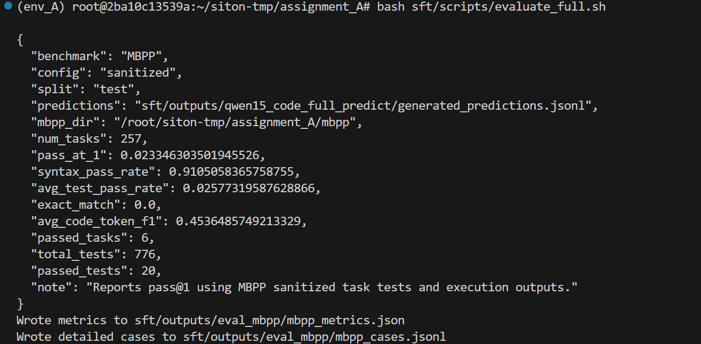
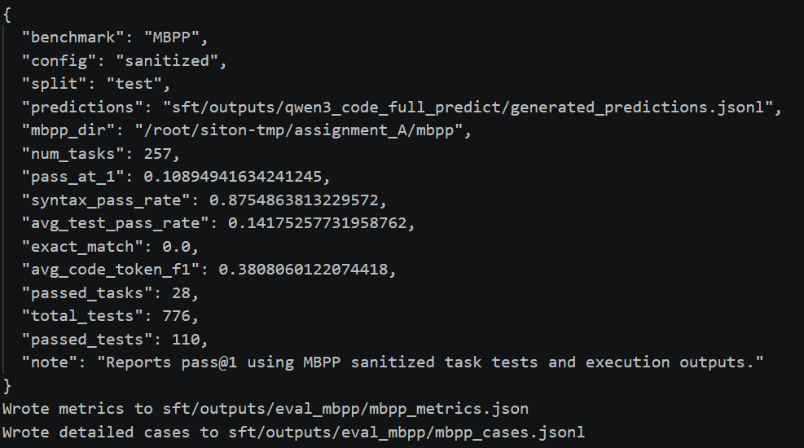
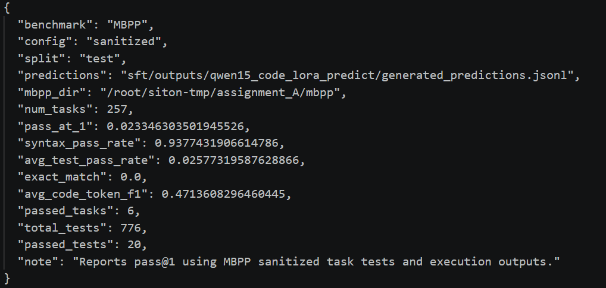
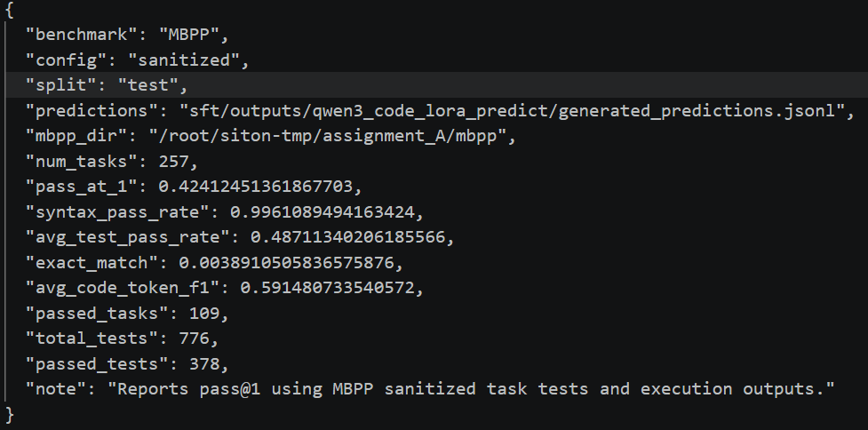
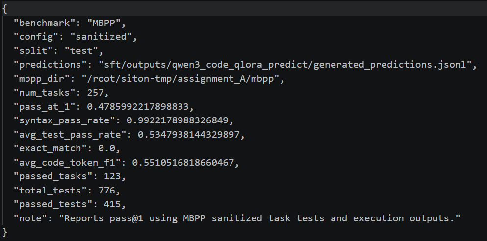

# 个人模块 README 模板

> 说明：本模板仅供参考，适用于A/B/C三个方向的个人模块说明。可以根据自己负责的模块、实现内容和演示结果适当调整结构，写出更详尽、直观的README。个人README的重点是讲清楚所负责的模块完成了什么基础功能、实现了什么进阶要求、如何独立运行，以及如何与团队系统对接。

---

## 1. 模块概述

### 1.1 模块名称

A2:SFT微调

### 1.2 模块说明

本模块主要用于提升大语言模型在代码生成任务中的错误修复能力。模块首先对 MBPP 数据集上的代码生成结果进行自动评测与错误分析，识别模型生成代码中的典型错误类型，包括语法错误、函数签名错误、输入输出格式错误、运行时错误、边界条件错误以及测试用例未通过等问题。

随后，将失败样本自动组织为：

题目描述 + 错误代码 + 执行报错信息 → 修复后代码

的监督微调数据格式，并利用这些样本对模型进行 Code Repair SFT 训练，使模型能够根据执行反馈自动修复错误代码。

该模块能够显著提升模型对代码执行反馈的理解能力和代码纠错能力，是完整代码智能体系统中的重要组成部分。

模块主要功能包括：

MBPP代码自动评测；
错误类型自动识别；
修复式数据集自动构建；
Code Repair LoRA训练；
自动生成修复结果；
自动计算修复成功率并生成分析报告。

### 1.3 完成情况概览

| 类型 | 完成情况 |
|---|---|
| 基础要求 | 完成 Full-SFT、LoRA、QLoRA 三种训练方式，并完成 MBPP 自动评测 |
| 进阶要求 | 完成错误分析模块和 Code Repair SFT 模块，实现基于执行反馈的自动代码修复 |
| 可独立运行的演示 | repair.sh 一键运行完整代码修复流程 |
| 与团队系统集成情况 | 作为代码生成模块后处理阶段接入完整系统，对失败样本自动进行修复 |

---

## 2. 环境、模型与数据依赖

### 2.1 运行环境

| 项目 | 要求 |
|---|---|
| Python 版本 | Python 3.11 |
| 必要依赖 | torch、transformers、datasets、peft、accelerate、LlamaFactory |
| 是否需要模型 | 需要 |
| 是否需要 GPU | 需要 |
| 是否需要外部数据集 | 需要 |

### 2.2 模型依赖


| 模型 | 来源 | 项目内相对路径 | 用途 |
|---|---|---|---|
|Qwen3-1.7B|	HuggingFace Qwen 官方仓库	|./Qwen3-1.7B	|基础代码生成模型
|Qwen3 Code LoRA|	本项目训练生成	|./sft/outputs/qwen3_code_lora	|代码生成任务微调
|Qwen3 Code Repair LoRA|	本项目训练生成	|./sft/outputs/qwen3_code_repair_lora	|错误代码修复任务    


### 2.3 数据集或样例数据依赖

如果本模块需要数据集、训练样本、测试文件、知识库、音频文件、表格或其他资源，说明来源和放置路径。

| 数据或文件 | 来源 | 项目内相对路径 | 用途 |
|---|---|---|---|
|MBPP Sanitized|	Google Research	|./mbpp	|代码生成训练与评测
|Code SFT Dataset|	项目构造	|./sft/data/code_sft_train.json	|代码生成训练
|Code Repair Dataset|	自动生成	|./sft/data/code_repair_train.json	|修复任务训练
|Repair Validation Dataset|	自动划分	|./sft/data/code_repair_valid.json	|修复验证
|Repair Test Dataset|	自动划分	|./sft/data/code_repair_test.json	|修复测试   
```bash
python sft/scripts/prepare_code_sft_data.py 
python sft/scripts/error_analysis.py 
python sft/scripts/prepare_code_repair_data.py 
python sft/scripts/split_repair_dataset.py
```

### 2.4 安装步骤

```bash
conda create -n env_A python=3.11 -y 
conda activate env_A
pip install torch torchvision torchaudio transformers datasets accelerate peft sentencepiece evaluate matplotlib 
```

本模块支持脱离完整系统独立运行，仅依赖上述环境即可完成训练、预测与评测。

---

## 3. 文件结构与接口边界

### 3.1 文件结构

只列出与本模块直接相关的文件，不需要复制整个团队项目目录。

```text
sft 
├── configs 
│ ├── qwen3_code_lora.yaml 
│ ├── qwen3_code_repair_lora.yaml 
│ └── qwen3_code_repair_predict.yaml 
│ ├── scripts │ ├── error_analysis.py 
│ ├── prepare_code_repair_data.py 
│ ├── split_repair_dataset.py 
│ ├── repair_predict.py 
│ ├── repair_execute.py 
│ ├── repair_eval.py 
│ ├── generate_repair_report.py 
│ └── repair.sh 
│ ├── data 
│ ├── code_repair_train.json 
│ ├── code_repair_valid.json 
│ └── code_repair_test.json 
│ └── outputs 
├── qwen3_code_repair_lora 
├── qwen3_code_repair_predict 
├── repair_eval_cases.jsonl 
└── code_repair_report.txt
```

### 3.2 接口边界

说明本模块接收什么输入、产生什么输出、由什么模块调用。

| 类型 | 来源 / 去向 | 数据格式 | 说明 |
|---|---|---|---|
|输入|MBPP 自动评测模块|JSONL|错误代码及执行反馈|
|输入|用户代码生成结果|Python代码文本|待修复代码|
|输出|Repair Dataset Generator|Alpaca JSON|修复式训练数据|
|输出|Code Repair LoRA|LoRA权重|修复模型参数|
|输出|Repair Evaluation|JSONL/TXT|修复结果与分析报告|
|输出|团队系统代码生成模块|Python代码文本|自动修复后的代码结果|

```bash
模块调用流程如下：

代码生成模型
        ↓
MBPP自动评测
        ↓
错误分析模块
        ↓
构建修复式SFT数据集
        ↓
Code Repair LoRA训练
        ↓
生成修复代码
        ↓
自动评测修复效果
        ↓
输出修复报告
```
---

## 4. 基础要求实现与演示

### 4.1 基础功能说明

本模块完成了课程要求中的代码生成模型监督微调任务，实现了基于 Qwen1.5-0.5B-Chat和Qwen3-1.7B 模型的代码生成能力训练，并分别采用 Full-SFT、LoRA 和 QLoRA 三种微调方法进行实验对比。

基础功能主要包括：

```text
进行对大模型进行提示学习；
基于 Qwen3-1.7B 的监督微调训练；
使用 MBPP 数据集进行自动评测；
自动计算 BLEU、ROUGE、Pass@1 等代码生成指标；
对 Full-SFT、LoRA、QLoRA 三种训练方式进行性能比较。
```

对应课程基础要求：

```text
完成 SFT 数据集构建；
完成至少一种大模型监督微调方法；
完成代码生成任务验证；
完成实验结果分析。
```


### 4.2 基础功能实现路径

说明基础功能主要由哪些文件、函数或脚本实现，以及关键流程是什么。
```text
（1）数据预处理阶段

将原始 Python 指令数据和 MBPP 数据集转换为 LlamaFactory 所需的 Alpaca 格式：

原始数据
    ↓
数据清洗
    ↓
字段标准化
    ↓
Alpaca格式转换
    ↓
训练数据集
（2）模型训练阶段

使用 Qwen3-1.7B 作为基础模型进行监督微调训练：

训练数据
    ↓
Tokenizer编码
    ↓
Qwen3-1.7B
    ↓
Full-SFT / LoRA / QLoRA
    ↓
微调模型
（3）模型评测阶段

使用 MBPP 测试集进行自动评测：

模型生成代码
    ↓
自动执行测试用例
    ↓
统计Pass@1
    ↓
生成评测报告
```
主要实现文件：


| 文件 / 函数 / 脚本 | 作用 |
|---|---|
|[prepare_code_sft_data.py]|构建 Alpaca 格式训练数据|
|[prepare_data.sh]|自动执行数据准备流程|
|[qwen3_code_full_sft.yaml]|Full-SFT 配置文件|
|[qwen3_code_lora.yaml]|LoRA 配置文件|
|[qwen3_code_qlora.yaml]|QLoRA 配置文件|
|[train.sh]|启动训练|   
|[predict.sh]|执行模型预测|
|[eval_mbpp.py]|MBPP 自动评测|    
|[generated_predictions.jsonl]|保存模型生成结果|
|[mbpp_metrics.json]|保存最终评测指标|

关键训练配置：

```text
finetuning_type: lora 
lora_rank: 32 
lora_alpha: 64 
lora_dropout: 0.05 
learning_rate: 1e-4 
num_train_epochs: 3
```


### 4.3 基础功能输入格式与样例

| 字段 / 输入文件 | 类型 / 格式 | 是否必需 | 说明 |
|---|---|---|---|
|instruction|String	|是|代码任务描述|
|input|String	|否|额外输入信息|
|output|String	|是|标准代码答案|

训练样例：
```text
{
  "instruction": "Write a function to calculate factorial.",
  "input": "",
  "output": "def factorial(n):\n    if n == 0:\n        return 1\n    return n * factorial(n-1)"
}
```

样例输入：

| 样例文件 | 用途 |
|---|---|
|sft/data/code_sft_train.json|代码生成训练数据|
|sft/data/code_sft_valid.json|验证集|
|sft/data/mbpp_sanitized_train.json|MBPP训练集|
|sft/data/mbpp_sanitized_validation.json|MBPP验证集|
|sft/data/mbpp_sanitized_test.json|MBPP测试集|

### 4.4 基础功能演示命令

```bash
数据预处理
bash sft/scripts/prepare_data.sh
Full-SFT训练
bash sft/scripts/train.sh
LoRA训练
bash sft/scripts/train_lora.sh
QLoRA训练
bash sft/scripts/train_qlora.sh
模型预测
bash sft/scripts/predict_full.sh
bash sft/scripts/predict_lora.sh
bash sft/scripts/predict_qlora.sh
数据评测
bash sft/scripts/evaluate_full.sh
bash sft/scripts/evaluate_lora.sh
bash sft/scripts/evaluate_qlora.sh
MBPP自动评测
python sft/scripts/eval_mbpp.py

```
运行后需要重点观察：

模型训练损失是否持续下降；
验证集准确率是否稳定提升；
Pass@1 是否明显提高；
不同微调方法之间的性能差异。

### 4.5 基础功能输出格式

| 输出文件 / 返回字段 | 格式 | 说明 |
|---|---|---|
|generated_predictions.jsonl|JSONL|模型生成代码|
|mbpp_metrics.json|JSON|MBPP评测结果|
|mbpp_cases.jsonl|JSONL|每个任务详细执行结果|
|training_loss.png|PNG|训练损失曲线|
|training_eval_accuracy.png|PNG|验证准确率曲线|
|checkpoint-*|模型权重|微调模型参数|

```text
MBPP 评测输出示例：

{
  "pass_at_1": 0.1089,
  "syntax_pass_rate": 0.8754,
  "avg_test_pass_rate": 0.1417,
  "passed_tasks": 28,
  "total_tests": 776,
  "passed_tests": 110
}
```

### 4.6 基础功能结果截图

插入基础功能独立运行截图，或关键输出文件截图。






## 5. 进阶要求实现与演示


### 5.1 选择的进阶要求

| 进阶要求 | 是否完成 | 对应文件 / 函数 | 简要说明 |
|---|---|---|---|
|改为 LoRA / QLoRA 微调|是|train_lora.sh、train_qlora.sh|使用 LoRA / QLoRA 配置文件训练模型|
|设计 LoRA 超参数对比实验|是|qwen3_code_lora_rank16.yaml，qwen3_code_lora_predict_rank16.yaml|对比不同 LoRA 超参数对模型性能的影响|
|代码错误分析模块|是|error_analysis.py|自动识别模型生成代码中的典型错误类型并生成分析报告|
|代码修复式 SFT 任务|是	|prepare_code_repair_data.py、repair_predict.py、repair_execute.py、repair_eval.py	|构造“错误代码→修复代码”训练数据并训练模型进行自动代码修复

### 5.2 进阶功能 1：`LoRA / QLoRA 参数高效微调`

#### 功能说明

```text
传统 Full SFT 会更新模型全部参数，对于 1.7B 规模模型训练成本较高，显存占用较大。

因此本模块进一步实现：

LoRA 微调
QLoRA 微调
Full SFT 基线模型

并比较：

显存占用
可训练参数数量
训练速度
MBPP测试性能

从而验证参数高效微调在代码任务中的效果。
```

#### 实现路径

| 文件 / 函数 / 脚本 | 作用 |
|---|---|
|qwen3_code_full_sft.yaml|Full SFT配置|
|qwen3_code_lora.yaml|LoRA配置|
|qwen3_code_qlora.yaml|QLoRA配置|
|train.sh|训练脚本|
|predict_full.sh|推理脚本|
|predict_lora.sh|推理脚本|
|predict_qlora.sh|推理脚本|
|evaluate_mbpp.py|MBPP自动评测|


```text
MBPP数据集
    ↓
LlamaFactory训练
    ↓
生成模型
    ↓
MBPP测试集推理
    ↓
自动执行测试用例
    ↓
输出 pass@1 与测试结果
```

#### 输入格式与样例

| 字段 / 输入文件 / 配置项 | 类型 / 格式 | 是否必需 | 说明 |
|---|---|---|---|
|model_name_or_path|String	|是|基础模型路径|
|finetuning_type|String	|是|微调方式（lora / qlora）|
|lora_rank|Integer	|是|LoRA低秩矩阵维度|
|lora_alpha|Integer	|是|LoRA缩放系数|
|lora_dropout|Float	|是|LoRA Dropout概率|
|lora_target|String	|是|插入LoRA层的位置|
|quantization_bit|Integer	|QLoRA必需	量化位宽|
|learning_rate|Float	|是|学习率|
|num_train_epochs|Integer	|是|训练轮数|
|dataset|String	|是|训练数据集名称|

#### 演示命令

```bash
bash sft/scripts/run_all_lora.sh
```

#### 配置样例
```text
model_name_or_path: ./Qwen3-1.7B

finetuning_type: lora

lora_target: all
lora_rank: 32
lora_alpha: 64
lora_dropout: 0.05

learning_rate: 1e-4
num_train_epochs: 3
```
#### 示例图片






### 5.3 进阶功能 2：`LoRA超参数对比实验`

#### 输入格式与样例

| 字段 / 输入文件 / 配置项 | 类型 / 格式 | 是否必需 | 说明 |
|---|---|---|---|
|lora_rank|Integer	|是|LoRA秩|
|lora_alpha|Integer	|是|LoRA缩放参数|
|learning_rate|Float	|是|学习率|
|num_train_epochs|Integer	|是|训练轮数|
|output_dir|String	|是|输出模型路径|

#### 实验样例

|实验编号|lora_rank|lora_alpha|learning_rate|num_train_epochs|output_dir|
|---|---|---|---|---|---|
|Exp1|32|64|1e-4|3|exp1|
|Exp2|16|64|1e-4|3|exp2|
|Exp3|32|32|1e-4|3|exp3|
|Exp4|32|64|2e-4|3|exp4|
|Exp5|32|64|1e-4|5|exp5|


|模型/配置|对应预测文件|Pass@1 ↑|Syntax Pass Rate ↑|Avg Test Pass Rate ↑|Exact Match ↑|Code Token F1 ↑|Passed Tasks|Passed Tests|
|---|---|---|---|---|---|---|---|---|
|Full SFT|qwen15_code_full_predict|0.1089|0.8755|0.1418|0.0000|0.3808|28|110|
|LoRA (Baseline)|qwen3_code_lora_predict|0.4241|0.9961|0.4871|0.0039|0.5915|109|378|
|QLoRA|qwen3_code_qlora_predict|0.4786|0.9922|0.5348|0.0000|0.5511|123|415|
|LoRA + Learning Rate = 2e-4|qwen3_code_lora_predict_learning_rate_2e-4|0.4436|0.9844|0.5103|0.0078|0.5990|114|396|
|LoRA + Alpha=32|qwen3_code_lora_predict_alpha32|0.4202|0.9961|0.4858|0.0039|0.5943|108|377|
|LoRA + Rank=16|qwen3_code_lora_predict_rank16|0.4202|0.9961|0.4858|0.0039|0.5943|108|377|
|LoRA + Epoch=500|qwen3_code_lora_predict_epo500|0.3969|0.9767|0.4485|0.0078|0.5756|102|348|

```text
Full Fine-tuning 表现最差
Pass@1 仅为 10.89%。
说明在小规模训练数据条件下，全参数微调容易发生过拟合，并且 0.5B 模型参数更新不稳定。
LoRA 显著优于 Full SFT
Pass@1 从 10.89% 提升到 42.41%。
证明参数高效微调更加适合当前的小样本代码生成任务。
QLoRA 取得最佳总体性能
Pass@1 达到 47.86%。
Avg Test Pass Rate 达到 53.48%。
共通过 123 个任务、415 个测试用例。
在性能和显存占用之间取得了最佳平衡。
提高学习率到 2e-4 有一定收益
Pass@1 提升到 44.36%。
Code Token F1 达到所有实验中的最高值 0.5990。
说明适当增大学习率能够提高代码生成质量。
增加 LoRA Rank 和 Alpha 效果有限
Rank=16 与 Alpha=32 的结果几乎一致。
相较默认 LoRA 并没有明显提升。
表明当前任务已经接近模型容量上限。
过长训练导致性能下降
Epoch=500 时 Pass@1 下降至 39.69%。
表现出明显的过拟合现象。
```

### 5.4 进阶功能 3：`代码错误分析模块`

#### 输入格式与样例

| 字段 / 输入文件 / 配置项 | 类型 / 格式 | 是否必需 | 说明 |
|---|---|---|---|
|mbpp_cases.jsonl|JSONL|是|MBPP评测详细结果|
|task_id|Integer|是|任务编号|
|code|String|是|模型生成代码|
|passed|Boolean|是|是否通过测试|
|error|String|否|错误信息|
|syntax_ok|Boolean|是|是否语法正确|
|passed_tests|Integer|是|通过测试数量|
|total_tests|Integer|是|总测试数量|

#### 输入样例
```text
{
    "task_id": 16,
    "code": "def text_lowercase_underscore(): pass",
    "passed": false,
    "syntax_ok": true,
    "passed_tests": 0,
    "total_tests": 3,
    "stderr": "TypeError: takes 0 positional arguments but 1 was given"
}
支持识别错误类型：

Syntax Error
Function Signature Error
Input/Output Format Error
Runtime Error
Runtime Timeout
Boundary Condition Error
Failed Test Cases
```
### 5.5 进阶功能 4：`代码修复式 SFT 任务`

#### 输入格式与样例

| 字段 / 输入文件 / 配置项 | 类型 / 格式 | 是否必需 | 说明 |
|---|---|---|---|
|instruction|String|是|修复任务描述|
|input|String|是|错误代码修复输入|
|output|String|是|正确修复代码|
|prompt|String|是|原始题目描述|
|wrong_code|String|是|错误代码|
|execution_feedback|String|是|测试失败信息|

#### 数据组织格式

题目描述
+
错误代码
+
失败测试用例/报错信息
↓
修复后代码

#### 输入样例
```text
{
  "instruction":
  "Fix the Python code according to the problem description and execution feedback.",

  "input":
  "Problem Description:\nWrite a function to remove characters from the first string which are present in the second string.\n\nWrong Code:\ndef str_to_list(string, chars):\n    result=[]\n    for c in string:\n        if c not in chars:\n            result.append(c)\n    return result\n\nExecution Feedback:\nNameError: name 'remove_dirty_chars' is not defined",

  "output":
  "def remove_dirty_chars(string, chars):\n    result=''\n    for c in string:\n        if c not in chars:\n            result += c\n    return result"
}
```
#### 数据集文件
|文件|作用|
|---|---|
|code_repair_report.txt|修复分析报告|
|code_repair_train.json	|修复训练集|
|code_repair_valid.json	|修复验证集|
|code_repair_test.json	|修复测试集|

#### 预测输出样例
```text
================================================================================
Repair Case 1
================================================================================

Task ID: 11

Problem Description
--------------------------------------------------------------------------------
Write a python function to remove first and last occurrence of a given character from the string.

Wrong Code
--------------------------------------------------------------------------------
def remove_Occ(string, char):
    new_string = ""
    for i in range(1, len(string)-1):
        if string[i] == char:
            continue
        else:
            new_string += string[i]
    return new_string

Execution Feedback
--------------------------------------------------------------------------------
Traceback (most recent call last):
  File "/tmp/mbpp_eval_8l84t49x/candidate_test.py", line 13, in <module>
    assert remove_Occ("hello","l") == "heo"
           ^^^^^^^^^^^^^^^^^^^^^^^^^^^^^^^^
AssertionError


Repaired Code
--------------------------------------------------------------------------------
<think>

</think>

def remove_Occ(s,ch): 
    for i in range(len(s)): 
        if (s[i] == ch): 
            s = s[0 : i] + s[i + 1:] 
            break
    for i in range(len(s) - 1,-1,-1): 
        if (s[i] == ch): 
            s = s[0 : i] + s[i + 1:] 
            break
    return s

Reference Code
--------------------------------------------------------------------------------
def remove_Occ(s,ch): 
    for i in range(len(s)): 
        if (s[i] == ch): 
            s = s[0 : i] + s[i + 1:] 
            break
    for i in range(len(s) - 1,-1,-1):  
        if (s[i] == ch): 
            s = s[0 : i] + s[i + 1:] 
            break
    return s

Repair Success : True
Similarity     : 0.9639
```
#### 输出结果
|输出文件|格式|说明|
|---|---|---|
|generated_predictions.jsonl|JSONL|修复代码生成结果|
|repair_execute_results.jsonl|JSONL|修复代码执行结果|
|repair_eval_cases.jsonl|JSONL|修复评测结果|
|code_repair_report.txt|TXT|修复分析报告|

---

## 6. 与团队系统的集成说明

说明个人模块如何被团队完整系统调用。


---

## 7. 已知问题与后续改进

| 问题 | 当前原因 | 后续改进 |
|---|---|---|
| `[问题 1]` | `[原因]` | `[改进]` |
| `[问题 2]` | `[原因]` | `[改进]` |

